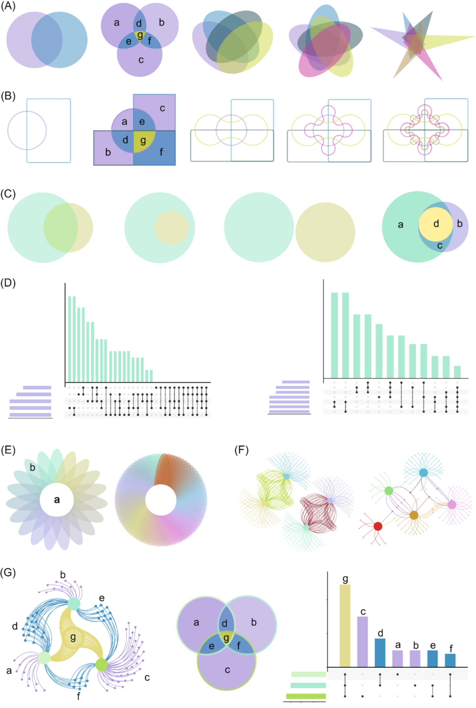
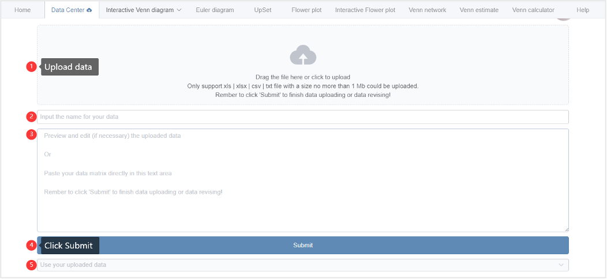
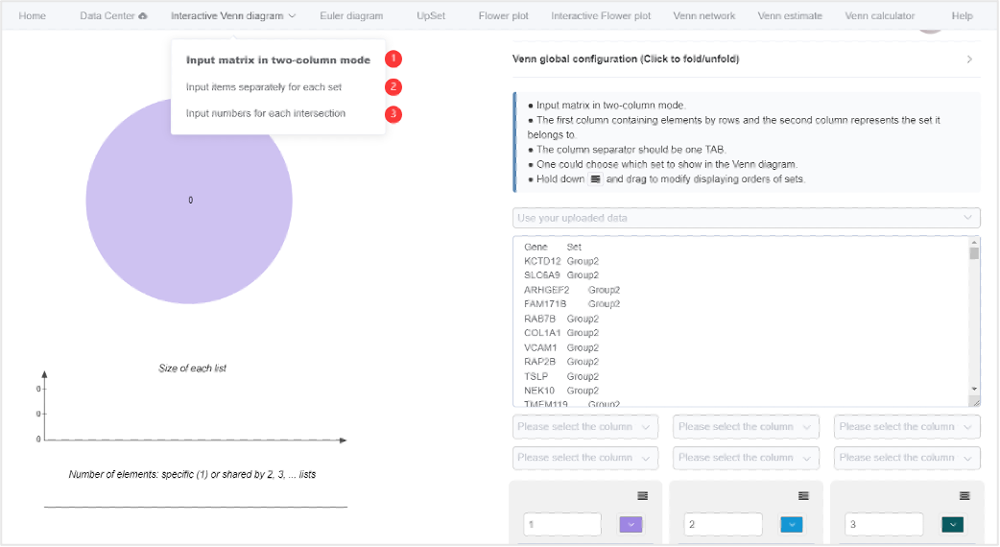
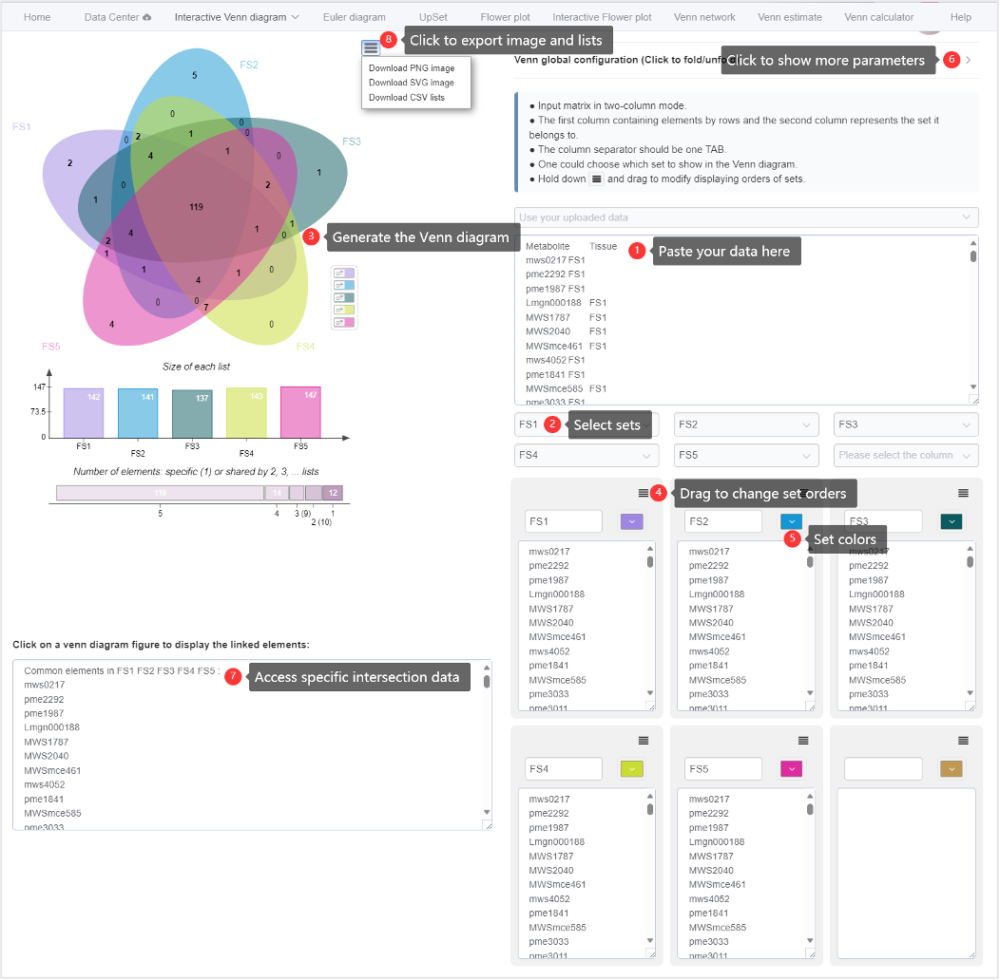
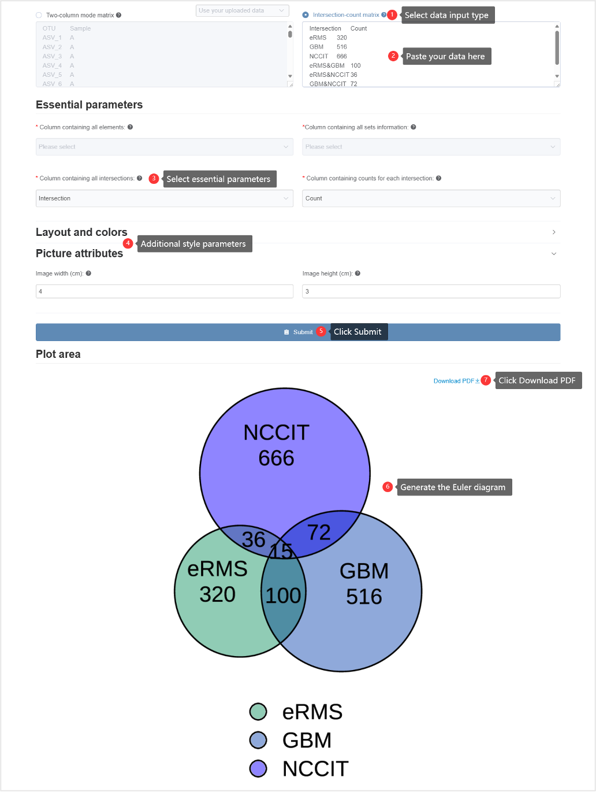
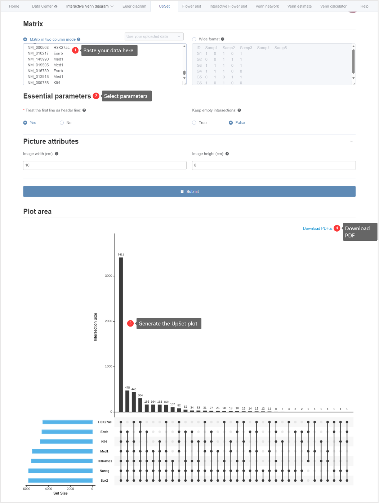
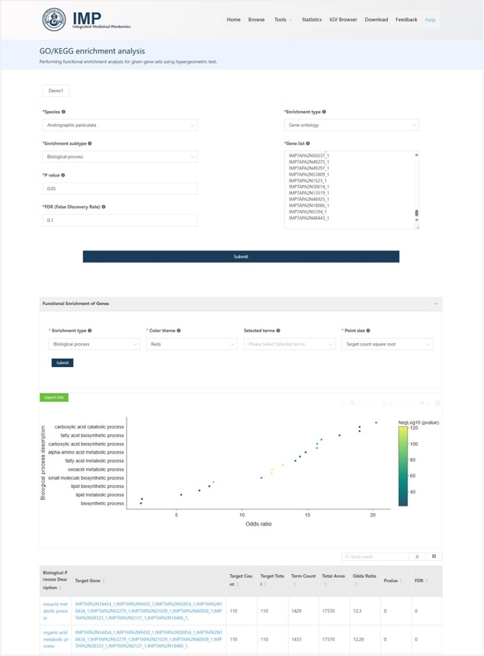

# 最全可视化集合工具EVenn使用手册 {#evennchineseprotocol}


## EVenn界面和代表性结果  {#eveen_representative_result}


EVenn平台的主界面提供了十个模块：数据中心、交互式韦恩图、交互式爱德华图、欧拉图、UpSet图、花瓣图、交互式花瓣图、韦恩网络、韦恩差异显著性分析以及韦恩计算模块。其中交互式韦恩图、交互式爱德华图、欧拉图、UpSet图、花瓣图及交互式花瓣图，均可用于比较不同组织的差异代谢物、不同组织或条件下的基因表达谱、不同样本中的蛋白质组成、不同疾病或条件下的生物标志物、不同药物处理组与对照组之间的筛选结果，以及不同样本中的菌群共存（OTUs）。韦恩网络图对于分析基因互作、蛋白质-蛋白质互作和代谢物互作网络特别有价值。例如，它能在网络图中展示富集的KEGG通路或GO条目中基因的共存情况。此模块同样适用于转录组、基因组及其他组学数据的分析。

```{r imt2184fig0001m, fig.cap="EVenn的代表性结果示意图。（A）2至6组集合的交互式标准韦恩图；（B）2至6组集合的交互式爱德华图；（C）2至3组集合的欧拉图；（D）显示空交集和不显示空交集的UpSet图；（E）19组和70组集合的花瓣图；（F）4至5组集合的韦恩网络图；（G）韦恩图、UpSet图和韦恩网络图三者之间的对应关系图。"}

```

以下，我们提供了详细解释，以阐明每个模块生成的代表性结果图及其适用条件。

## 交互式韦恩图/爱德华图 {#interactivevennedward}


EVenn的交互式韦恩图具有多重用途，允许用户在标准韦恩图和爱德华图之间无缝切换，同时便于探索和绘制多达**6**组数据。标准韦恩图通常用于比较2到6组实验数据（图 \@ref(fig:imt2184fig0001m) A），这里使用颜色编码来表示每组的特有和共有元素。

> 例如，紫色（a，b，c）代表每组特有元素，蓝色（d，e，f）表示两组之间的共有元素，黄色区域（g）表示三组共同存在的元素。

相比之下，交互式爱德华图在集合多时能更清晰地展示各个部分，特别是在涉及5到6组的情况下（图1B）。

> 以三组为例，其中a、b和c表示特有元素的区域，d、e和f代表两组中的共有元素区域，g代表三组中的共有元素。

## 增强可视化的欧拉图 {#eulerdiagram}


相较于韦恩图，欧拉图在数据允许的情况下*省略了空交集区域*，从而提升了多个集合可视化的精确性，有更好地视觉效果和呈现力。欧拉图通常用于2至3组实验数据，生成圆圈的大小同集合中元素数目成正相关，交集区域的大小与共享元素的数量成正比。这一特性清晰地描述集合之间的部分包含、完全包含及完全排除关系（如图 \@ref(fig:imt2184fig0001m) C所示）。

在图 \@ref(fig:imt2184fig0001m) C 所展示的三个集合例子中，每个圆圈的大小表示其各自集合中元素的数量，圆圈越大表示元素数量越多。

> 绿色（a）与紫色（b）代表各自集合的特有元素，而重叠区域（c）代表两个集合之间共有的元素。此外，黄色区域（d）表示了三个集合共有元素。欧拉图有效地展示出集合之间的包含关系，为集合交互提供了更直观地视觉化表现。

## UpSet图：一个强大的集合交集分析工具 {#upsetdescription}


UpSet图作为一个创新的可视化技术，专为集合交集的定量分析而设计，能够处理包含3至40个集合的复杂数据集。它通过两种展示模式，巧妙地可视化了不同的集合组合关系。如图 \@ref(fig:imt2184fig0001m) D所示，该图有三个主要组成部分：

* 一个水平条形图表示每个集合中的总元素数量，
* 一个垂直条形图指示对应交集中的元素数量，
* 以及一个带有连接点的矩阵，勾勒出集合之间所有的关系类型。

在这个例子中，单独一个黑色点代表每个集合中的特有元素，而有线连接的黑色点象征着集合之间共有的元素。UpSet图全面展示了集合之间的关系，

> 其中两个黑点的连接表示两个集合共有的元素，三个黑点的连接表示三个集合共有的元素，四个黑点的连接则表示四个集合共有的元素，以此类推。


## 花瓣图：揭示多组数据集的复杂关系  {#flowerplotdes}

当处理超过**十组**的复杂数据集时，传统的可视化方法如韦恩图、欧拉图和UpSet图会难以应对。花瓣图是平衡解读性与信息丰富度的一种可视化方式。图 \@ref(fig:imt2184fig0001m) E的左侧展示了一个包含`19`个集合的花瓣图，而右侧是包含`70`个集合的花瓣图。


在图 \@ref(fig:imt2184fig0001m) E中，中心圆圈（a）代表所有集合共有的元素。围绕它的每个椭圆（b）表示每个集合相比于其它所有集合中特有元素的数量，或者是每个集合减去共有元素后的元素，这取决于具体的参数设置。


## 韦恩网络：揭示集合间的相互联系 {#vennnetworkdes}


韦恩网络拓展了标准韦恩图的展示边界，不仅是展现交集和并集的关系，而且可以展示出具体的元素。它将每个`集合`指定为一个大的`父节点`，每个`元素`指定为一个小的`子节点`，并通过边将各个元素也就是子节点连接至其相应的父节点，来描绘`集合内`和`集合间`的关系。韦恩网络布局的灵活性在图 \@ref(fig:imt2184fig0001m) F中得到展示，韦恩网络会根据不同的数据类型呈现出相应的结构形态，已更好展现数据内集合之间的固有关系。


在图 \@ref(fig:imt2184fig0001m) F中，4个集合和5个集合的网络图揭示了它们元素之间的复杂关系。

> 每个元素，由一条边连接表示其是各集合的特有元素。两条连接边线表示两个集合的交集，而三条边线代表三个集合的交集。韦恩网络展示了数据集内外相互连接的视觉层次。

## 韦恩图、UpSet图与韦恩网络三者之间的对应关系  {#vennupsetvennnetworkrelationship}


在图 \@ref(fig:imt2184fig0001m) G中，我们借助一个三集合场景，展示了`韦恩网络`、`韦恩图`和`UpSet图`之间的对应关系以更好地理解这三种展示形式。每张图通过相应的字母标记一致的元素区域，确保了对这三种可视化之间关系的清晰理解。字母和颜色的一致性便于轻松识别同类型的关系组合：黄色（g）表示三个集合共有的元素，而蓝色（d、e、f）表示了两个集合共有的元素。与此形成对比的是，紫色（a、b、c）表示每个集合独有的元素。


## EVenn数据中心简化输入数据 {#evenndatacenter}

EVenn的数据中心使用标准化的两列矩阵格式来简化输入过程，适用于韦恩图、欧拉图、UpSet图、花瓣图、交互式花瓣图、韦恩网络和韦恩计算工具。这种用户友好的格式，确保所有工具都可兼容，以第一行作为标题行，第一列是元素（例如，基因或OTUs），第二列对应各自的集合，一个TAB键用作列分隔符。准备这种输入矩阵非常简单，可以通过Excel、其他兼容的文本编辑器或简单程序完成。数据中心提供了两种文件上传模式—本地文件上传和直接粘贴数据上传。这种灵活的数据输入方式和标准化的数据格式，提升了用户体验，并加速了从数据准备到深入分析的过程。


(ref:fig181) 输入数据格式见 章节\@ref{inputfileformat}。


```{r fig181, fig.cap="(ref:fig181)"}
knitr::include_graphics("image/Fig1.png")
```


上传文件是个很简单的过程，虽说是 5 步，但实际不复杂。首先拖动或点击文件以启动上传（图 \@ref(fig:figs1)，步骤1）。其次为文件赋予独一无二的名称，以便轻松识别（图 \@ref(fig:figs1)，步骤2）。所上传文件的内容将自动充填至指定文本区域（图 \@ref(fig:figs1)，步骤3），用户可浏览及修改数据。最后点击“提交”按钮完成上传过程（图 \@ref(fig:figs1)，步骤4）。一旦完成，文件将在文件选择界面中显示（图 \@ref(fig:figs1)，步骤5），在打开每个工具时可以直接选择这里上传的文件进行分析和展示。

```{r figs1, fig.cap="数据上传"}

```


另一种数据输入的方法是将数据直接粘贴至数据中心的文本域。首先输入文件名以便标识（图 \@ref(fig:figs2)，步骤1），然后将数据矩阵粘贴至指定文本区（图 \@ref(fig:figs2)，步骤2）。点击“提交”完成保存过程（图 \@ref(fig:figs2)，步骤3）。上传的文件也会在文件选择器中显示（图 \@ref(fig:figs2)，步骤4）。
为有效管理上传文件，数据中心允许最多保存五个文件。为了加入新文件，可在“提交”按钮下方的下拉菜单中有选择地删除旧文件后再保存（图 \@ref(fig:figs2)，步骤5）。需留意，这些文件存储在您本地的网页浏览器，并未上传至我们的服务器。因此，关闭您的网页浏览器有可能导致这些上传文件的丢失，且无法从您电脑的其他网页浏览器访问这些文件。

```{r figs2, fig.cap="数据粘贴"}

```


## 数据智能参数限制 {#intelligentparameterctrl}

为了提升用户体验并防止因输入不准确或操作失误引起的错误，EVenn引入了数据智能参数限制。例如，欧拉图支持两种输入矩阵类型，并根据数据类型的不同，条件性地启用或禁用某些可设置参数。在双列模式下，调整仅限于包含所有元素的列和包含所有集合信息的列。此外，在让用户确定列名时采用一个用户友好的下拉框取代开放式输入框，以减少打字错误并通过限制用户的选择范围更好地提示用户的操作。这些优化显著提高了EVenn界面的易用性，确保了更流畅的使用体验。

## 案例展示 {#evenncases}


```{r imt2184fig0002m, fig.cap=" EVenn案例展示（A）茯苓5个部位处理前后差异代谢物的交互式韦恩图；（B）茯苓5个部位处理前后差异代谢物的交互式爱德华图；（C）抗癌药物治疗后三种细胞差异表达基因的欧拉图；（D）7个转录调控因子及其靶向基因ChIP-seq的UpSet图；（E）交互式花瓣图展示18个微生物组共有和特有OTUs数量；（F）交互式花瓣图展示18个微生物组共有及减去共有后的OTUs数量；（G）韦恩网络图展示穿心莲基因GO富集分析结果；（H）韦恩网络图展示穿心莲四个生物过程富集分析结果（仅展示共有和特有基因）。"}
knitr::include_graphics("image/imt2184-fig-0002-m.jpg")
```

### 案例一：交互式韦恩图展示差异代谢物 {#case1}

韦恩图以直观的方式比较和分析不同条件或组织中的代谢物、基因和OTUs的重叠情况。例如，以研究茯苓处理前后不同部位的代谢物变化为例（[表S1](data/tableS1.txt)）。交互式韦恩图支持三种不同的数据输入方法：使用两列格式上传或粘贴数据（默认模式）（图 \@ref(fig:figs3)，步骤1），直接粘贴每个集合的元素（输入元素）（图 \@ref(fig:figs3)，步骤2），以及手动输入每个交集的计数（输入数字）（图 \@ref(fig:figs3)，步骤3）。

```{r figs3, fig.cap="交互式韦恩图支持的三种不同的数据输入方式"}

```

在此，我们展示了使用粘贴两列矩阵输入方法生成交互式韦恩图的简便过程，有效地展示了茯苓5个部位的差异代谢物。该方法包括下面一系列步骤： 

1. 数据矩阵输入：将差异代谢物数据矩阵以两列格式粘贴至文本区域（图 \@ref(fig:figs4)，步骤1）。第一列是代谢物名称，第二列是其检测部位信息。
2. 集合选择：按照顺序选择FS1、FS2、FS3、FS4及FS5集合进行分析（图 \@ref(fig:figs4)，步骤2）。
3. 生成交互式韦恩图：上述两个步骤完成后（其实每选择一步，都可以看到韦恩图在当前状态下的展示），将生成一个交互式韦恩图，展示茯苓5个部位差异代谢物的交集情况（图 \@ref(fig:figs4)，步骤3）。
4. 重排集合顺序：通过点击并拖动集合（FS1、FS2、FS3、FS4及FS5），将集合调整到理想位置（这里也可以删除集合）（图 \@ref(fig:figs4)，步骤4）。
5. 自定义集合颜色：使用位于每个集合名称旁的颜色选择器（图 \@ref(fig:figs4)，步骤5），为5个集合自定义颜色，分别为它们指定黄色、粉色、绿色、紫色及蓝色。
6. 全局配置参数：点击配置按钮激活全局配置参数（图 \@ref(fig:figs4)，步骤6）。相应选择“经典模式”或“爱德华模式”。字体、字号、输入列表统计、切换按钮及交集计数是否展示都保持默认参数。
7. 访问特定交集数据：点击韦恩图中的计数数字，下方文本区域显示该交集的差异代谢物名称（图 \@ref(fig:figs4)，步骤7）。标题显示差异代谢物的所属的特定集合区域。
8. 下载选项：通过点击下载按钮，获取差异代谢物PNG和SVG格式韦恩图，以及差异代谢物交集列表CSV格式文件（图 \@ref(fig:figs4)，步骤8）。

```{r figs4, fig.cap="交互式韦恩图绘制步骤"}

```


图 \@ref(fig:imt2184fig0002m) A和B分别展示了茯苓5个部位的标准韦恩图和爱德华图。可见茯苓5个部位（FS1、FS2、FS3、FS4及FS5）共有119个处理后出现一致变化的差异代谢物。此外，FS1、FS2、FS3、FS4及FS5分别有2、5、1、0、4个处理后独特变化的差异代谢物。进一步地分析发现：FS1和FS2、以及FS2和FS3之间无相同的差异代谢物；FS3和FS4共有1个差异代谢物，而FS4和FS5共有7个差异代谢物。韦恩图清晰地描绘了茯苓处理前后5个部位差异代谢物的变化关系。


### 案例二：欧拉图展示差异表达基因关系 {#casestudy2}


通过分析文献中抗癌药物处理后不同类型细胞中差异基因关系，来展示欧拉图工具的使用。欧拉图工具支持两种类型数据输入方法：两列模式矩阵和计数矩阵。利用该工具生成差异表达基因欧拉图的具体步骤如下： 
1. 数据整理：整理文献中每种类型细胞的差异表达基因数量并呈现在[表S2](data/tableS2.txt)中。
2. 选择输入类型：选择交集-计数矩阵方法（图 \@ref(fig:figs5)，步骤1）。
3. 数据输入：将差异表达基因的两列计数矩阵粘贴到交集-计数矩阵框中（图 \@ref(fig:figs5)，步骤2）。第一行是标题行，第一列是所有集合的交集部分，第二列是每个交集的元素数量。此外，第一列中的“&”符号代表交集，TAB键作为列分隔符。
4. 基本参数选择：参数“Intersection Column containing all intersections”选择“交集”，参数“Column containing counts for each intersection”参数选择“计数”（图 \@ref(fig:figs5)，步骤3）。
5. 其他类型参数：此处，布局和颜色以及图片属性参数使用默认设置（图 \@ref(fig:figs5)，步骤4）。
我们对复杂的颜色参数设置进一步说明。这里提供两种定义颜色的方法：为每个集合手动设置颜色和手动设置颜色向量（颜色集）（图 \@ref(fig:figs6)A）。
为每个集合手动设置颜色：设置每个集合的颜色。选择颜色时，请确保点击颜色选择器中的“确定”按钮（图 \@ref(fig:figs6)B）。此参数的使用与手动设置颜色向量（颜色集）参数互斥。启用此参数前，请确保清除手动颜色设置向量（颜色集）的值。如果您想为每个集合指定颜色，应选择相同数量的颜色（图 \@ref(fig:figs6)B）。如果选取的颜色数量少于集合数，程序将自动生成中间色以使其与集合的数量相等。
手动设置颜色向量（颜色集）：为所有集合选择颜色向量。此参数与为每个集合手动设置颜色参数互斥（图 \@ref(fig:figs6)C）。首先请清除为每个集合手动设置颜色参数的值，以启用此参数。
6. 生成欧拉图：点击“提交”按钮（图 \@ref(fig:figs5)，步骤5），在绘图区显示差异表达基因的欧拉图（图 \@ref(fig:figs5)，步骤6）。右击图片可以保存成PNG格式，也可以通过点击“下载PDF”按钮，将图片保存成PDF格式（图 \@ref(fig:figs5)，步骤7）。

```{r figs5, fig.cap="欧拉图绘制步骤"}

```

```{r figs6, fig.cap="欧拉图颜色设置"}
knitr::include_graphics("image/imt128figures6.png")
```

通过上述步骤生成了图 \@ref(fig:imt2184fig0002m) C，可以看出NCCIT细胞特有的差异表达基因最多为666个，在图中占据了最大的面积。相比之下，NCCIT、Erms和GBM之间的共有差异基因数量最少，仅有15个基因，因此占据了图中最小的面积。采用欧拉图，与文献中原有的可视化方式相比提高了差异表达基因数量展示的精准性。


### 案例三：UpSet图展示ChIP-seq数据 {#casestudy3}


ChIP-seq是研究表观组学中广泛应用的技术，用于探索蛋白质与DNA之间互作和了解基因组的功能元件。在本案例研究中，我们对小鼠胚胎干细胞（ESC）中5个转录因子（Esrrb、Klf4、Med1、Nanog、Sox2）和2个组蛋白修饰标记（H3K27ac与H3K4me1）的ChIP-seq数据进行了分析，旨在确定它们共有和特有的结合位点。这些ChIP-seq数据源自Whyte等人的研究 ([表S3](data/tableS3.txt))。UpSet图的生成接受两种输入格式：两列矩阵和二进制矩阵格式。生成ChIP-seq UpSet图的步骤如下： 

1. 数据集预处理：利用ImageGP (<https://www.bic.ac.cn/BIC>)平台将[表S3](data/tableS3.txt)中Sox2、Nanog、Klf4、Esrrb、H3K27ac、Med1、H3K4me1及其结合基因数据转换成两列格式，如[表S4](data/tableS4.txt)所示(<https://www.bic.ac.cn/BIC>，图 \@ref(fig:figs7)，步骤1)。
2. 选择数据输入类型：选择两列矩阵格式输入数据。
3. 数据输入：以两列格式粘贴转录调控因子和靶向基因数据，第一列是靶向基因，第二列是转录调控因子(图 \@ref(fig:figs8)，步骤1)。
4. 基本参数选择：参数“将第一行作为标题行”，设置为“是”，而参数“保留空相交”设置为“假”(图 \@ref(fig:figs8)，步骤2)。
5. 生成UpSet图：点击“提交”按钮(图 \@ref(fig:figs8)步骤3)即可得到UpSet图。然后，点击“下载PDF”按钮(图 \@ref(fig:figs8)步骤4)即可下载PDF格式的图片。

(ref:figs7) 采用 BIC (<https://www.bic.ac.cn/BIC/#/>)平台进行数据转换

```{r figs7, fig.cap="(ref:figs7)"}
knitr::include_graphics("image/imt128figures7.png")
```

```{r figs8, fig.cap="UpSet 图绘制步骤"}

```


如图 \@ref(fig:imt2184fig0002m) D所示，UpSet图展示了7个调控因子之间的共有和特有结合或修饰的基因，其中有3411个基因受到7个转录调控因子的共同调控，此外，还有475个基因仅与Sox2、Nanog、Klf4、Esrrb、Med1和H3K4me1结合。值得注意的是，这七个转录调控因子各自并没有特有的结合基因。通过UpSet图可以有效地可视化它们与结合位点之间的复杂关系。


### 案例四：交互式花瓣图展示微生物群落的特异性 {#casestudy4flowerplot}


探究微生物群落特异性对于理解生态角色、疾病诊断、揭示进化过程以及探索关键菌群至关重要。交互式花瓣图作为一种宝贵的工具，能够展示超过十个微生物群落组中的共有和特有的元素。通过EasyAmplicon流程获取不同组（敲除组、野生型及过表达组）的操作分类单元（OTU）数据。生成微生物组交互式花瓣图，请遵循以下步骤： 

1. 数据预处理：使用ImageGP平台将[表S5](data/tableS5.txt)的数据转换为两列格式（转换后的数据见[表S6](data/tableS6.txt)）。
2. 两列模式数据矩阵输入：将微生物OTUs数据粘贴到数据框的指定文本区域（第一列是元素，即OTUs或ASVs，第二列是集合名称，即样本组）。
3. 选择参数：为元素选择“OTUID”列，为集合信息选择“Group”列。对于椭圆中展示的数值的参数，分别选择两种模式。其余参数保持默认设置。
4. 生成交互式花瓣图：点击“提交”按钮生成交互式花瓣图。通过点击图片中的数字可以获取各个组的共有和特有元素。
5. 下载SVG：将图片以SVG格式导出。 

```{r figs9, fig.cap="花瓣图绘制步骤"}
knitr::include_graphics("image/imt128figures9.png")
```

图 \@ref(fig:imt2184fig0002m) E展示了18个样本组共有413个相同OTUs。其中，WT3、OE1和KO3集合包含独特的OTUs，分别是ASV_942、ASV_1022和ASV_1201。相反，其余15个组缺乏独特OTUs。图 \@ref(fig:imt2184fig0002m) F也展示了18个微生物组中413个相同OTUs元素的存在，但是围绕中心圈的18个花瓣则代表在减去共有元素后每组的OTUs元素计数。运用两种不同花瓣图展示方法对于从多个角度分析OTUs在较多样品组中的相似性和差异性具有优势。

### 案例五:韦恩网络显示GO富集结果 {#casestudy5}

为了展示韦恩网络可视化功能，我们通过IMP平台（<https://www.bic.ac.cn/IMP>）提供的GO/KEGG富集分析工具，获取了穿心莲的基因及GO数据。所获得的数据集，如图 \@ref(fig:figs10)所示，包含了生物过程条目与其关联的基因。我们的目标是构建一个韦恩网络图，展示富集到的生物通路与基因的网络关系。具体操作如下： 


1. 数据预处理：筛选所需的基因和GO数据，使用 ImageGP平台（https://www.bic.ac.cn/BIC）将数据转换成韦恩网络所需的两列格式（图 \@ref(fig:figs7)，步骤2，[表S7](data/tableS7.txt)）。
2. 数据矩阵输入：将上面转换出的 2 列矩阵粘贴到文本域中，注意目标基因需要在第一列，GO条目需要在第二列（图 \@ref(fig:figs11)，步骤1）。
3. 选择参数：设置颜色和展示模式两个参数可以自由选择。例如，我们选择了粉色、绿色、紫色和蓝色作为颜色参数（图 \@ref(fig:figs11)，步骤2）。此外，先选择“显示所有元素”模式以全面展示数据，也可以选择“仅显示共有元素及特有元素”模式展示类似花瓣图中的数据统计（图 \@ref(fig:figs11)，步骤3）。
4. 生成韦恩网络图：点击“提交”按钮后，生成韦恩网络图（图 \@ref(fig:figs11)，步骤4）。
5. 优化韦恩网络图布局：为了优化韦恩网络图的清晰度和美观性，访问“工具菜单”（图 \@ref(fig:figs11)，步骤5）并使用“首选布局”按钮（图 \@ref(fig:figs11)，步骤6）。随后，点击工具按钮以显示左侧工具栏（图 \@ref(fig:figs11)，步骤7），修改节点、边、布局参数。其中，边类型参数设置为“diagonalCross”，布局模式中布局计算算法设置为“barnesHut”，而其他设置保持默认值（图 \@ref(fig:figs11)，步骤8-9）。
6. 韦恩网络的节点和边参数：我们提供了一个“编辑X节点”按钮，用于更改多个选定节点的属性，以及一个“编辑边”按钮，用于更改边的宽度和颜色（图 \@ref(fig:figs11)，步骤10-11）。节点和边的颜色方案如图 \@ref(fig:imt2184fig0002m)G所示。
7. 下载韦恩网络图：点击“导出SVG”按钮，以SVG格式导出韦恩网络图（图 \@ref(fig:figs11)，步骤 12）。

(ref:figs10) IMP平台（<https://www.bic.ac.cn/IMP>）的GO/KEGG富集分析工具。

```{r figs10, fig.cap="(ref:figs10)"}

```

```{r figs11, fig.cap="EVenn网络绘制步骤"}
knitr::include_graphics("image/imt128figures11.png")
```

如图 \@ref(fig:imt2184fig0002m)  G所示，IMPTAPA2N19692_1基因参与到四个关键生物过程：monocarboxylic acid biosynthesis、cellular amino acid metabolism、organitogen compound biosynthesis和multiple organismal enrichment process。基因IMPTAPA2N21328_1、IMPTAPA2N31674_1、IMPTAPA2N40577_1、IMPTAPA2N11277_1、IMPTAPA2N33800_1和IMPTAPA2N22367_1与monocarboxylic acid biosynthesis和multiple organismal enrichment process相关。此外，IMPTAPA2N33400_1特异性从属于organitogen compound biosynthesis过程。图 \@ref(fig:imt2184fig0002m) H描绘了四个不同生物过程中共有和特有基因的存在。

 


## 结论 {#discussionevenn}

韦恩图数据分析的复杂性源于数据格式的不一致和缺乏统一的数据分析平台。本文全面概述了EVenn平台内各个模块的功能与操作，包括数据中心、交互式韦恩图、欧拉图、UpSet图、花瓣图、交互式花瓣图以及韦恩网络图。

在不同实验条件下比较代谢物、基因、基因组区域和微生物类群等数据，常需借助专门的可视化技术，包括交互式韦恩图、欧拉图、UpSet图、花瓣图和交互式花瓣图。其中，

* 交互式韦恩图特别适用于比较多达6组实验数据，允许直观识别共性与差异。
* 相比之下，欧拉图更适合比较2到3组实验数据，通过面积比例表示每组的数据大小。
* UpSet图可以比较3组至40组复杂的数据集。
* 而花瓣图在评估10组以上数据的共有与特有元素时更常用，可以清晰地展示多组数据关系。
* 此外，韦恩网络图是用网络形式展示集合关系的有效工具。它可以揭示多组实验之间的关系，展示复杂的交互模式。

总之，选择哪种可视化方法取决于数据和研究目的。通过理解每个工具的功能，研究人员可以有效地解释和展示他们的结果。

数据和脚本已在GitHub (<https://github.com/Tong-Chen/venn-doc>)和Gitee(<https://gitee.com/ct5869/venn-doc/>)发布。所有的补充材料（文本、图、表、中文翻译版本或视频）也可从线上获取。


