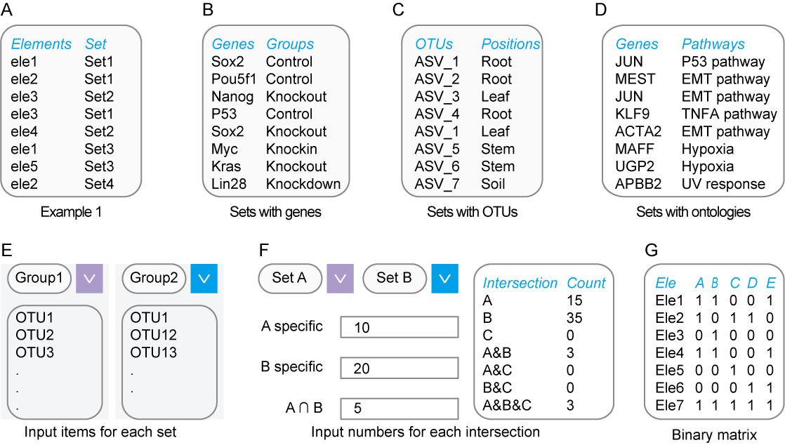

# Input file format {#inputfileformat}

## The unified two-column matrix for all tools {#unifiedforall}

In EVenn, we unified the input data in one simple format for all tools. It is a two-column regular matrix with: 

1. The `first` column containing elements by rows. 
2. And the `second` column specifies the set each item belongs to, so we named it as **two-column mode** (Fig \@ref(fig:fig1) A-D). 
3. If one item belongs to several sets, it may appear in several rows. 
4. The order of rows does not matter. 
5. The order of columns matters at least for interactive `Venn diagrams` and `Venn networks`. 

This type of data could be easily generated using Excel or other text-editors with just ‘copy-paste’ operations. It could also be generated program-ably in any analysis pipeline with addition or changing only few codes. 

Another advantage of this specified format is that it is both human and machine readable, and could be saved for repeatable usages. Based on the unified input format, it is feasible to generate and compare different visualization ways during the data exploring stage and result showing stage. Leaving out of the trouble of file format changing for separate tools, which is essential and not so trivial for researchers who could not program.  

```{r fig1, fig.cap="Illustration of input data formats. A. The general example of two-column data matrix. B, C, and D represent specified examples for gene sets, OTUs sets and pathway sets respectively. E. Pasting elements for each set separately. F. Typing counts for each intersection. G. Binary matrix format. "}

```

## Specifialized input formats for some tools {#specifiedforsome}

Besides, the classical input formats for each tool were also preserved for meeting various requirements. For example:

1. Pasting elements for each set separately and naming each set on the fly for interactive Venn diagram (Fig \@ref(fig:fig1) E).
2. Input the counts instead of related elements of each intersections to draw interactive Venn diagrams and Euler diagrams (Fig \@ref(fig:fig1) F). This is useful for counting data such as cell immunofluorescence experiments how many cells are stained as <font color="#FF0000">red</font>, how many cells are stained as <font color="#00FF00">green</font>, how many cells have merged color of <font color="#FFFF00">yellow</font>.
3. UpSet also supports a binary matrix for illustrating elements existence  (Fig \@ref(fig:fig1) G). In this format, the first line is the header line containing names of all sets. Each row represents one element. Each column represents each set. Each row represents one element. A value of non-zero representing the corresponding element belongs to the corresponding set.


