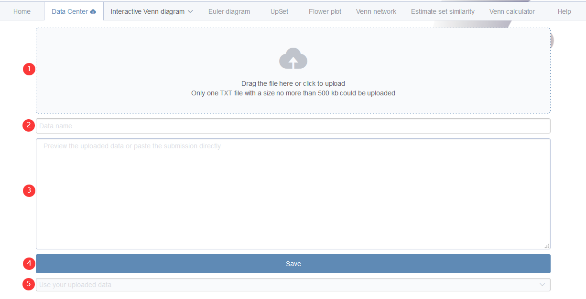

# Upload files in data center

*Attention*: The files would not be uploaded to our server in this step. They only exist in a local region in your web browser. These uploaded files would be lost after the web browser is closed. Also, one could not see these uploaded data in other web browsers. 


## Upload a file

1. Drag your file or click to upload your file (\@ref(fig:figdatacenter1) <font color="#FF0000">1</font> step).
2. Input a name for your file for identification (\@ref(fig:figdatacenter1) <font color="#FF0000">2</font> step).
3. The content of the uploaded file would be loaded into the text area (\@ref(fig:figdatacenter1) <font color="#FF0000">3</font> step). Users are allowed to browse and revise uploaded data if necessary.
4. Remember to click **Save** or **Submit** to finish the uploading process (\@ref(fig:figdatacenter1) <font color="#FF0000">4</font> step).
5. Then your uploaded file would be shown in the file selector (\@ref(fig:figdatacenter1) <font color="#FF0000">5</font> step). One can browse or delete unneeded files.

```{r figdatacenter1, fig.cap="Upload your files."}

```


## Paste your data here

1. Input a name for your file for identification (\@ref(fig:figdatacenter2) <font color="#FF0000">1</font> step).
2. Paste the data matrix to the text area (\@ref(fig:figdatacenter2) <font color="#FF0000">2</font> step). 
3. Remember to click **Save** or **Submit** to finish the saving process (\@ref(fig:figdatacenter2) <font color="#FF0000">3</font> step).
4. Then your uploaded file would be shown in the file selector (\@ref(fig:figdatacenter2) <font color="#FF0000">4</font> step). One can browse or delete unneeded files.


```{r figdatacenter2, fig.cap="Paste your files."}

```


## Example files

