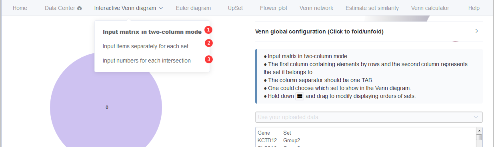
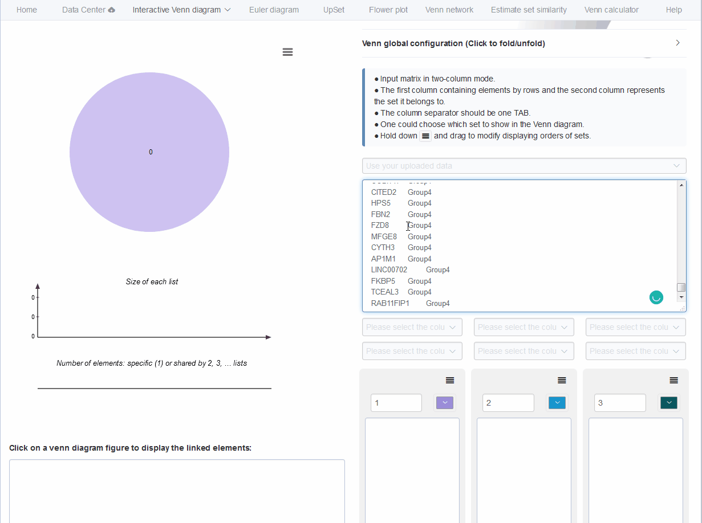
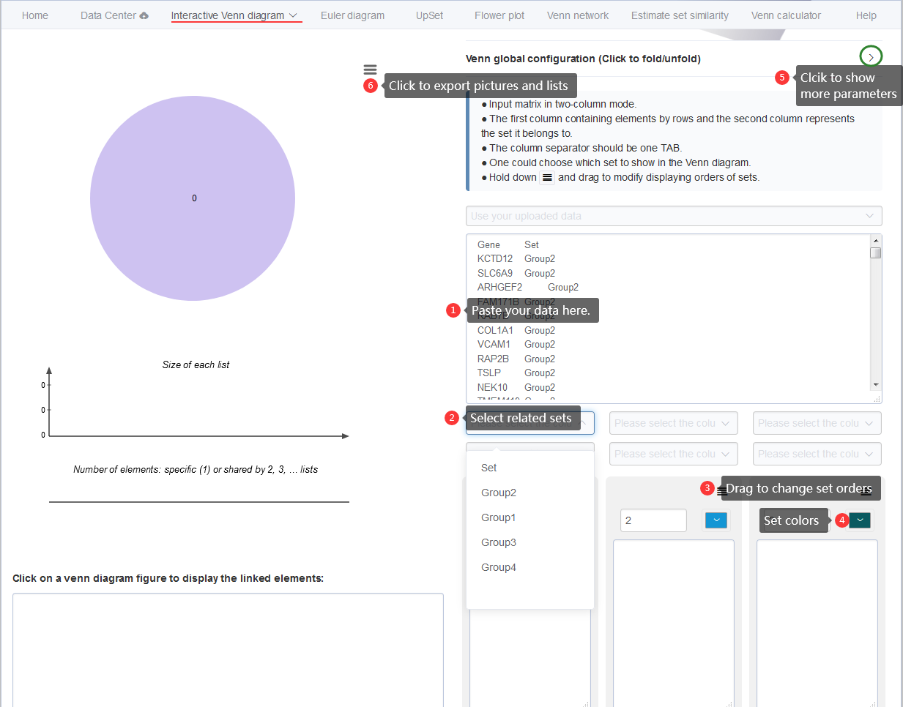
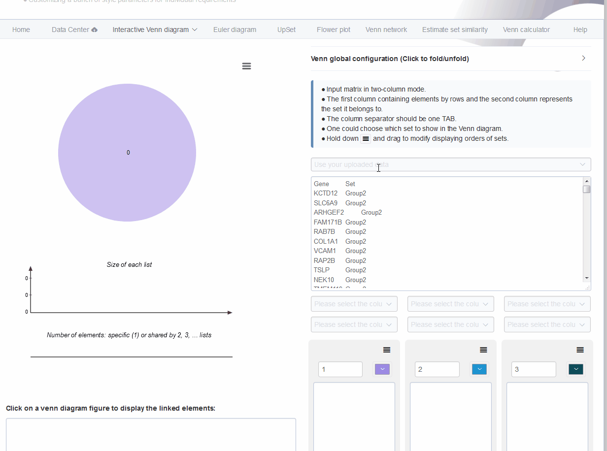

# Interactive venn diagram {#Interactive_venn_diagram}

This module supports interactive Venn diagram plotting and exploring for at most 6 sets. Through clicking figures in generated plots, one could easily get elements lists for each intersection part. This would facilitate screening candidate elements like genes or OTUs meeting specified intersection patterns. 

Besides, it has several functions like switching between standard *Venn layout* and *Edwards-Venn layout*, switch on and off different lists for comparing. 

Another useful improvement compared with Jvenn is that one can reorder each set to get better visualization by simple dragging of input text-areas. This function is especially useful when one wants to delete one or several sets, no need of re-input for already existed sets (Fig \@ref(fig:InteractiveVennDiagramoupload)). 
There are also parameters for changing font sizes, font families, sets colors and other displaying attributes. 


## Three types of input ways {#threetypeinputway}

Three types of input ways are supported for more feasible usages, 
* uploading or pasting all data together using two-column formats (Two-column mode, which is the default) ((Fig \@ref(fig:fig1) A) and Fig \@ref(fig:interactiveVennInit) <font color="#FF0000">1</font>), 
* directly pasting elements of each set (Input elements) ((Fig \@ref(fig:fig1) E) and Fig \@ref(fig:interactiveVennInit) <font color="#FF0000">2</font>), 
* typing in counts of each intersections (Input numbers) ((Fig \@ref(fig:fig1) F) and Fig \@ref(fig:interactiveVennInit) <font color="#FF0000">3</font>). 

```{r interactiveVennInit, fig.cap="Three types of input ways."}

```

The result picture could be exported in the scalable vector graphics (SVG) format which could be converted to high-resolution images or combined with other pictures for publication usages. Elements lists for each intersection could be downloaded in table format.


## Pasting two-column mode data matrix {#intervennpasting}

Here we use an animation showing the simple steps of generating and exploring an interactive Venn diagram with pasted two-column matrix (Fig \@ref(fig:InteractiveVennDiagramopate)).

```{r InteractiveVennDiagramopate, fig.cap="Animation illustrating the steps of generating interactive venn diagrams with pasted data matrix."}

```

We split these steps separately.

1. Paste your data matrix in two-column mode to the text-area (Fig \@ref(fig:InteractiveVennDiagram1) <font color="#FF0000">1</font> step).
2. Select which set to be analyzed in order. Unique value of the second column (including the header line if existed) would be saved in the drop-down menu as set names for selection (Fig \@ref(fig:InteractiveVennDiagram1) <font color="#FF0000">2</font> step). After several selection, we could get one Venn diagram showing left-top.
3. Set order could also be changed by holding on button (Fig \@ref(fig:InteractiveVennDiagram1) <font color="#FF0000">3</font>) and dragging to the target position.
4. color of each set could be customized separately using the color-picker beside set names (Fig \@ref(fig:InteractiveVennDiagram1) <font color="#FF0000">4</font>).
5. Global configuration parameters could be switched on by clicking button (Fig \@ref(fig:InteractiveVennDiagram1) <font color="#FF0000">5</font>), including display mode, font family, font size, statistics based on input lists (number of elements for each set), switch button, intersection counts. One could easily check their functions if not clearly described by simple clicking. 
6. Venn diagrams in *PNG*, *SVG* format and intersection elements in *CSV* lists could be downloaded by clicking button  (Fig \@ref(fig:InteractiveVennDiagram1) <font color="#FF0000">6</font>). In CSV lists, one column represents one type of non-empty intersections and attached elements. 
7. Click the count number in the Venn diagram would show the elements belonging to this intersection in below text-area with one headline showing elements' belonging. 


```{r InteractiveVennDiagram1, fig.cap="Displaying the steps for generating interactive venn diagrams with pasted data matrix in two-column mode."}

```

## Use the uploaded two-column mode data matrix {#vennupload}

Here we use an animation showing how to choose the uploaded data matrix (seeing section [2](#datacenter_uploading) for data uploading), selecting sets, removing sets, reordering sets and other operations for 6 sets (Fig \@ref(fig:InteractiveVennDiagramoupload)).

```{r InteractiveVennDiagramoupload, fig.cap="An animation illustrating the steps of generating interactive venn diagrams with previously uploaded data matrix."}

```


## Pasting elements of each set {#venneachset}

Most online Venn diagram tools use this kind of input, pasting elements for each set separately and name each set on the fly.

## Input numbers for each intersection {#venninputcount}

This is sometimes useful for drawing Venn diagrams without elements but only numbers, such as the counting results of cell immunofluorescence experiments: how many cells are stained as <font color="#FF0000">red</font>, how many cells are stained as <font color="#00FF00">green</font>, how many cells have merged color of <font color="#FFFF00">yellow</font>.


```{r pastenumbersvenngif, fig.cap="Draw Venn diagrams with number input. Only support 2-4 sets."}
knitr::include_graphics("image/pastenumbersvenn.gif")
```


