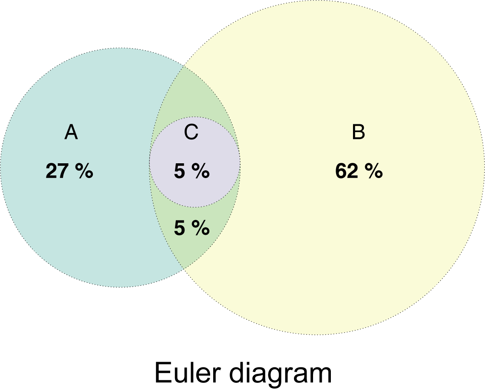
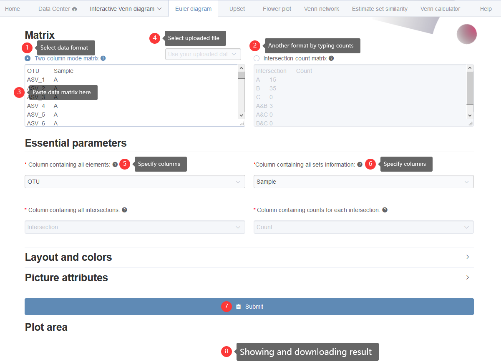
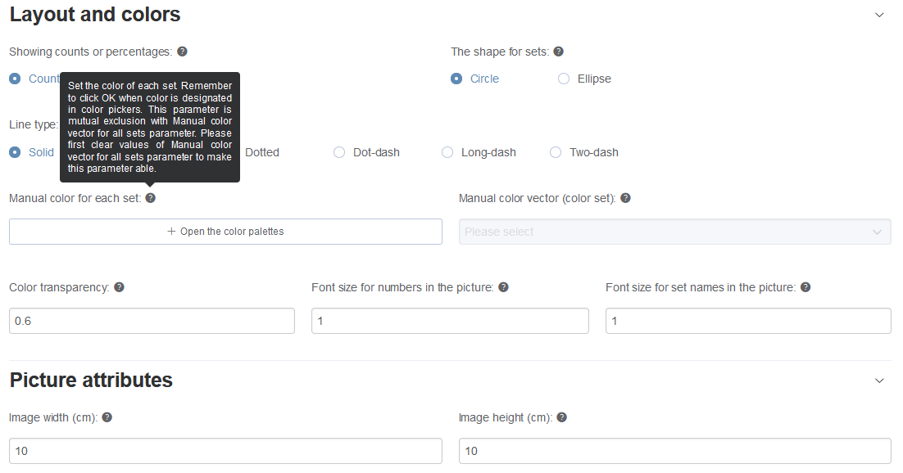
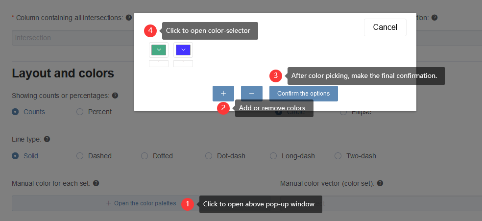
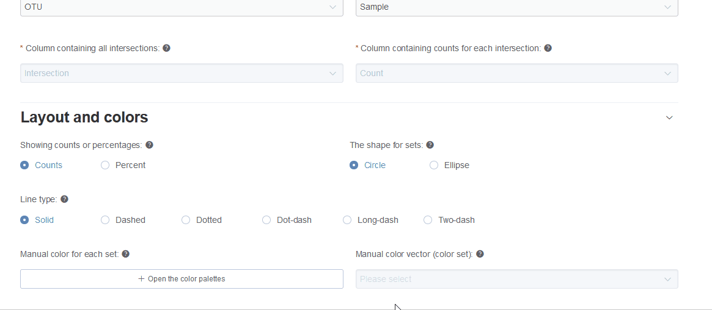

# Euler diagram {#Euler_diagram}

Euler diagram plots do not display empty intersection regions when possible, giving more concrete and accuracy visualization. Theoretically, it could have better visualization effects for more sets than Venn diagrams. And it could clearly show the fully-containing-relationships among 2 or several sets (Fig \@ref(fig:Euler_diagrampng)). In EVenn, Euler diagram generates area-proportional diagrams, in which the sizes of intersection areas positively correlated with number of intersection elements. This gives more perceptual intuition than only showing numbers.

```{r Euler_diagrampng, fig.cap="Illustration of fully contained sets using the Euler diagram." }

```

## Two types of input ways {#eulertwotypeinput}

Euler diagram supports two types of input. One is the two-column mode format matrix as we described above (Fig \@ref(fig:fig1 A)). 

The other is a count matrix also with two columns (Fig \@ref(fig:fig1 F)). The first line would be treated as the header line. The first column containing intersection parts of all sets by rows and the second column containing the number of elements in each intersection part. The `&` symbol in the first column represents intersecting. The column separator should be one `TAB`. 


## Pasting two-column mode data matrix {#eulerpasting}

Here we use an animation showing the simple steps of generating the Euler diagram with pasted two-column matrix (Fig \@ref(fig:eulerdiagrampaste)).

```{r eulerdiagrampaste, fig.cap="Animation illustrating the steps of generating Euler diagrams with pasted data matrix."}
knitr::include_graphics("image/eulerdiagrampaste.gif")
```

We split these steps separately.

First, users select the type of input format. Second, data matrix could be pasted to the text-area or selected from uploaded files. Third, two essential parameters would be filled in the option to set the information contained in each column. Users are allowed to change the default options if they have different column orders. Check the hints (holding the cursor on the question mark symbol) along each parameter for details. Forth, layout and color styles could be changed as required or leaved out for default. There are two mutual exclusion ways to set colors, setting color for each set or selecting one color vector to color all sets. In each way, the number of color is not needed to be the same as number of sets. The underlying program will try the best to deal with color assignments. Fifth, the width and height of output picture could be modified. Sixth, clicking submit button to get the result in PNG format showing below (save by right clicking on the picture). The result picture could also be downloaded in PDF format by clicking Download PDF button. 

1. Select one and only one data format  (Fig \@ref(fig:Euler_step1) <font color="#FF0000">1</font> and <font color="#FF0000">1</font> radio button). Supposing we select `Two-column mode matrix`.
2. Paste your data matrix in two-column mode to the text-area (Fig \@ref(fig:Euler_step1) <font color="#FF0000">3</font>) or select one uploaded file (Fig \@ref(fig:Euler_step1) <font color="#FF0000">4</font>) (See section [2](#datacenter_uploading) for data uploading.).
3. We assume the `first` column contains `elements` and the `second` column contains `sets` name and will automatically get the names of each column to fill in (Fig \@ref(fig:Euler_step1) <font color="#FF0000">5</font> and  <font color="#FF0000">6</font>). If your data matrix **does not** follow this assumption, one are allowed to change values of these two drop-down selection boxes.
4. Click 'Submit' (Fig \@ref(fig:Euler_step1) <font color="#FF0000">7</font>) and the result would be shown in 'Plot area' ((Fig \@ref(fig:Euler_step1) <font color="#FF0000">8</font>). 


```{r Euler_step1, fig.cap="Displaying the steps for generating Euler Venn diagrams with pasted data matrix in two-column mode."}

```

## Additional style parameters

Here lists more style parameters for customized usages.

```{r Euler_style.png, fig.cap="Lists of more parameters. Hovering over the question mark to see detail information."}

```

Most parameters could be selected very easily. Here we only explain the color setting parameters.

Here we supplied two ways to defined colors: `Manual color for each set` and `Manual color vector (color set)`.

* `Manual color for each set`: Set the color of each set. Remember to click **OK** when color is designated in color pickers (Fig \@ref(fig:color_set) and Fig \@ref(fig:ColorPicker)). This parameter is **mutual exclusion** with `Manual color vector (color set)` parameter. Please first clear values of `Manual color vector (color set)` to make this parameter able. If you want to assign color for each set, same number of colors should be picked. If the number of picked colors less than number of sets, the program would generate intermediate colors to make they equal.
* `Manual color vector (color set)`: Select the color vector for all sets. This parameter is mutual exclusion with `Manual color for each set` parameter. Please first clear values of `Manual color for each set` parameter to make this parameter able. 


```{r color_set, fig.cap="The way to set colors manually."}

```

```{r ColorPicker, fig.cap="An animation showing adding, picking, removing, clearing colors."}

```

