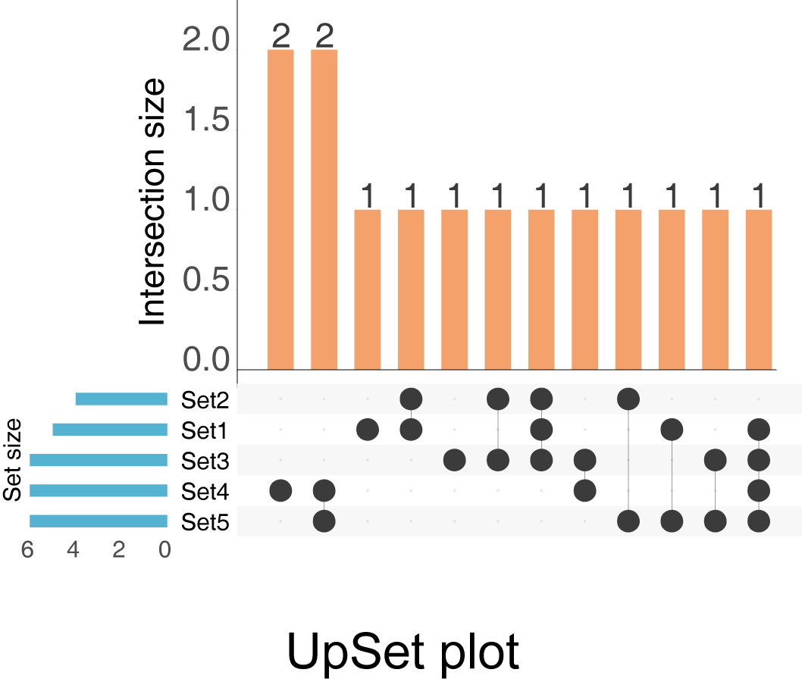
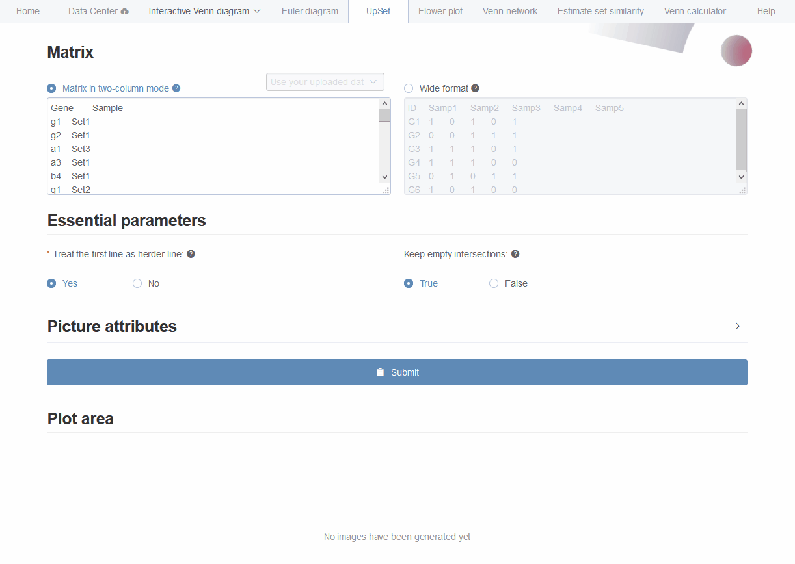

# UpSet {#UpSet}

Upset plot is designed as a novel visualization technique for the quantitative analysis of sets and their intersections (Fig \@ref(fig:upset_diagrampng)). It composed three parts, a horizontal bar-plot showing total number of elements of each set, a matrix with connected-dots indicating all types of intersections among sets, a vertical bar-plot representing number of elements of corresponding intersections. The bars are normally ordered by item counts, giving more direct decision of the largest sets and intersections. Intersections which are empty could be selectively hided to save space for visualizing much more sets. 

```{r upset_diagrampng, fig.cap="UpSet diagrams for 5 sets. Horizontal blue bars represent total number of elements of each set. Orange bars represent number of elements of each intersection indicated by connected dots." }

```

## Two types of input ways {#upsettwotypeinput}

Euler diagram supports two types of input. One is the two-column mode format matrix as we described above (Fig \@ref(fig:fig1 A)). 

The other is a binary matrix for illustrating elements existence  (Fig \@ref(fig:fig1 G)). In this format, the first line is the header line containing names of all sets. Each row represents one element. Each column represents each set. Each row represents one element. A value of non-zero representing the corresponding element belongs to the corresponding set. 


## Pasting two-column mode data matrix {#upsetpasting}

Here we use an animation showing the simple steps of generating the UpSet with pasted two-column matrix (Fig \@ref(fig:UpSetAnimationgif)).

```{r UpSetAnimationgif, fig.cap="Animation illustrating the steps of generating UpSet plot with pasted data matrix."}

```

1. First, data matrix could be pasted to the text-area or selected from uploaded files. 
2. Second, only one essential parameter to specify if the first line would be treated as header line. 
3. Third, users are allowed to set whether to keep empty intersections. 
4. Forth, the width and height of output picture could be modified. **Enlarge** this number if the graphic displaying is incomplete.
5. Fifth, clicking `submit` button to get the result in PNG format showing below (save by right clicking on the picture). The result picture could also be downloaded in `PDF` format by clicking `Download PDF button`.

