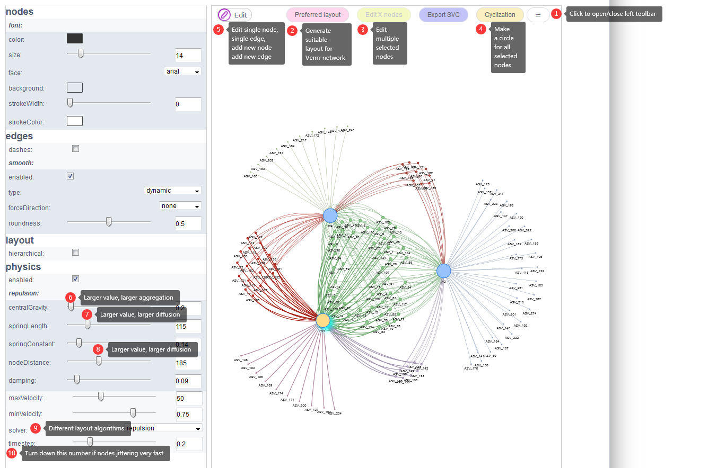

# Venn network {#vennnetwork}

Venn network could show both elements and their belonging sets in an interactive network diagram (Fig \@ref(fig:vennnetworkpng)). Each set would be treated as one parent node, each item would be connected to its parent nodes via edges. Elements connected with all sets are shared among them. Interactive venn network is implemented using vis.js with function extensions and simplified steps. 

```{r vennnetworkpng, fig.cap="Venn network for 3 sets. The three light-blue nodes represent sets KO, OE and WT. The purple nodes in the middle are shared among 3 sets. Those nodes connected with two edges are shared by every two sets. The outer nodes with only one connected edges are specially belonging to one set." }
knitr::include_graphics(c("image/Vennnetwork.png"))
```

## Two-column mode matrxi as input  {#venninput}

The two-column mode format matrix (Fig \@ref(fig:fig1 A)) is the required input for Flower plot. 


## Venn network using two-column mode data matrix {#vennanimation}

Here we use an animation showing the simple steps of generating the Venn network plot with the default demo data (Fig \@ref(fig:vennnetworkAnimationgif)).

```{r vennnetworkAnimationgif, fig.cap="Animation illustrating the steps of generating the Venn network plot with one uploaded two-column matrix."}
knitr::include_graphics("image/vennnetworkAnimation.gif")
```


1. First, data matrix could be pasted to the text-area or selected from uploaded files. Then other parameters are all optional. 
2. Second,color of each set could be assigned separately using the color picker or leaving out as default.  Each set should have one and only one color assignment.
3. Third, users are allowed to show all elements (simulating the `Venn diagram`) or show only common elements and specific elements of all sets (simulating the `Flower plot`). 
4. Forth, clicking `Submit` button to get the network showing below.
5. Fifth, One initial layout would be first loaded. Then users are suggested to click `Preferred layout`  button (Fig \@ref(fig:Vennnetworkparameters) <font color="#FF0000">2</font>) to get a suitable layout mode after 1-2 minutes animation. This button would usually give the optimized layout
6. Sixth, click the button ((Fig \@ref(fig:Vennnetworkparameters) <font color="#FF0000">1</font>)) to open the left tool bar to set more parameters. In our mind, the top 2 parameters for network layout is `springLength` and `nodeDistance` ((Fig \@ref(fig:Vennnetworkparameters) <font color="#FF0000">7</font> and <font color="#FF0000">8</font>)). Decreasing the numbers of either of these two parameters would make the network more aggregation. Increasing the numbers of either of these two parameters would make the network more diffuse.
7. In the end, the picture could be exported in `SVG` (`Export SVG` button) format for publication usages. 
 
```{r Vennnetworkparameters, fig.cap="List and label some parameters."}

```

 
## Parameter description for network layout

More visual and layout parameters are allowed to adjust for more specific situations. 

1. A node would be elected and highlighted by single clicking on it. 
2. Then its attribute (label, label font-size, size, shape, border width, background color, nodes border color, label color) could be modified by clicking `Edit`-`Edit node` button (Fig \@ref(fig:Vennnetworkparameters) <font color="#FF0000">5</font>). 
3. New nodes and edges could be added by two buttons: `Add node` and `Add edge` (Fig \@ref(fig:Vennnetworkparameters) <font color="#FF0000">5</font>). 
4. Multiple nodes could be selected using one of the following three methods. 
   1. Hold down `CTRL` on the keyboard and click nodes to be selected; 
   2. Hold down each candidate node for more than one `second` to select multiple nodes; 
   3. Draw a cursor `rectangle` with the `Right Mouse button` hold down to select multiple nodes. 
5. When multiple nodes were selected, their attributes (label font-size, size, shape, border width, background color, nodes border color, label color) could be changed in batch using the `Edit X-nodes` (Fig \@ref(fig:Vennnetworkparameters) <font color="#FF0000">3</font>) button. 
6. Nodes and edges styles could also be changed on ‘nodes’ and ‘edges’ menus in the left-side tool-bar. 
7. The overall layout could be changed using `hieratical` and `physics` menus in the left-side toolbar (Fig \@ref(fig:Vennnetworkparameters) <font color="#FF0000">6,7,8,9,10</font>).
8. Additionally, clicking `Cyclization` button (Fig \@ref(fig:Vennnetworkparameters) <font color="#FF0000">4</font>) will make all selected nodes form a circle.  


## Color setting for Venn network {#vennnetworkcolorpallete}

Each set should have **one and only one** color assignment. Please see Fig \@ref(fig:ColorPicker) for operation showing.


## Venn network showing gene ontology/KEGG enrichment informations {#vennenrichment}

In microbiome analysis, interpretation function impacting of genes with differential abundance among experimental groups is one major goal. Normally genes are associated with multiple gene ontology (GO) annotations or pathways. The using of bar-plot or dot-plot to show GO analysis results though simple but may loss information of GO relationships such as the percentage of genes shared by different categories. Venn network could show both ontologies and their relationships through common connected genes. This is also suitable for transcriptome, genome and other omics-data analysis. 


```{r Vennnetworkpathwaygif, fig.cap="Venn network showing gene onthlogy enrichment result."}
knitr::include_graphics("image/Vennnetworkpathway.gif")
```
