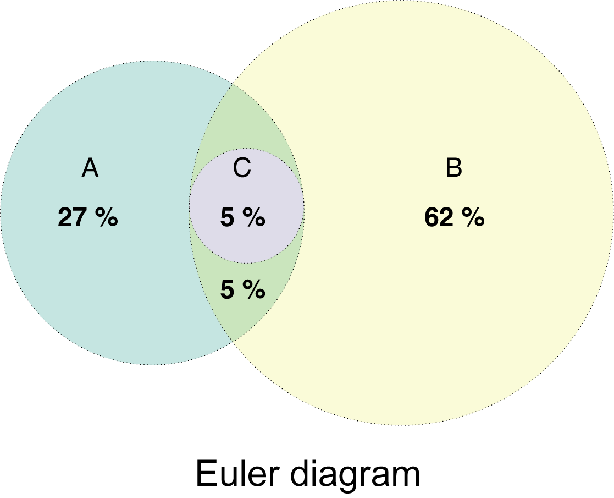
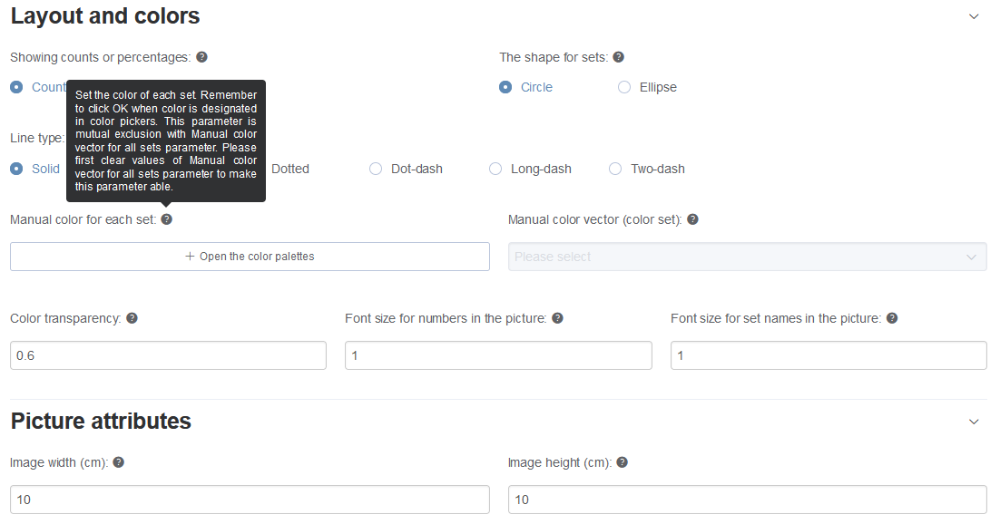
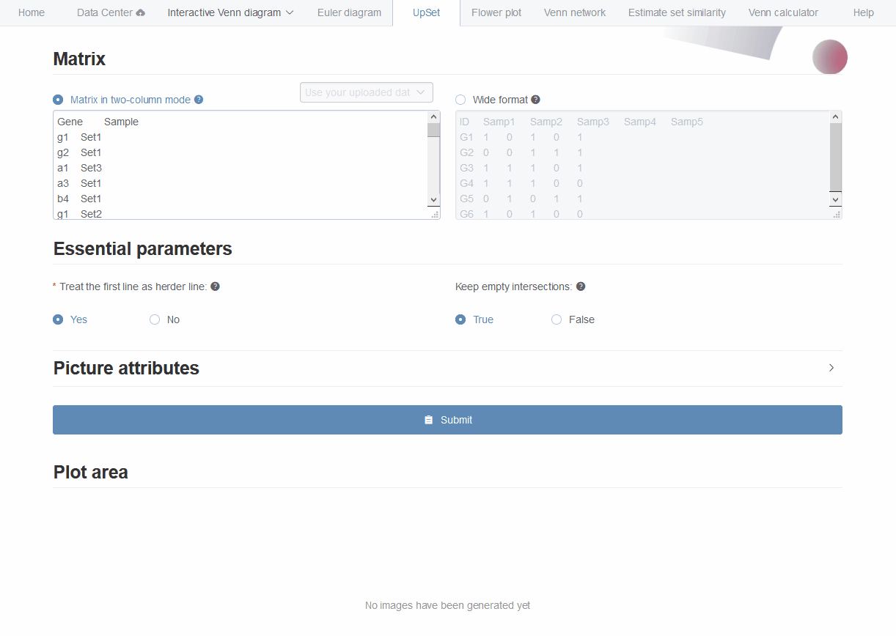
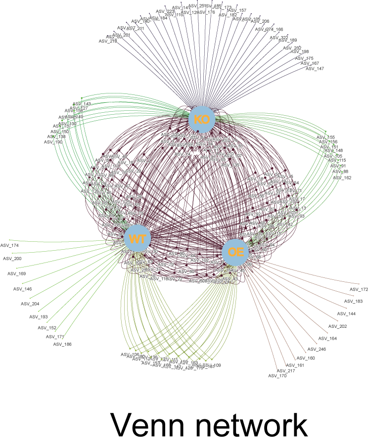

--- 
title: "EVenn: Easy to create repeatable, editable, and statistically measurable Venn diagrams online"
author: 
- "Chen Tong"
- "http://www.ehbio.com/test/venn"
- "chent@nrc.ac.cn"
date: "2021-07-02"
documentclass: article
site: bookdown::bookdown_site
---

# Overview of EVenn

[EVenn](http://www.ehbio.com/test/venn/#/) is constructed to generate Venn diagrams (classical and Edwards layout), Euler diagrams (proportional), UpSet, Flower plot and Venn network. Specially, we developed one unified data matrix as inputs for all tools. This type of input data could be easily prepared using Excel or other text-editors or simple programs. Once uploaded, the data file could be easily loaded to each tool to generate various displaying. This makes EVenn a more suitable tool for exploratory analysis and to choose the best way to explain and visualize data. In order to compute the significance of the overlap between two groups of elements which could be genes or OTUs, random sample test and Jaccard similarity test were applied. The tool Venn calculator could generate the counts and detailed elements for each non-empty intersection for datasets with any number of groups. The results could be used for downstream selection and also could be used as input for data visualization using EVenn. Evenn is available at http://www.ehbio.com/test/venn/. We also recorded a video showing how to generate 5 types of Venn diagrams in less than 3 minutes (which could be viewed in this tutorial or in YouTube with link https://youtu.be/sCEiaZpnL8Q or in China with link https://www.bilibili.com/video/BV1CK4y1P7Gi). 

<video controls width="100%">
    <source src="video/EVenn7.webm"  type="video/webm">
    Sorry, your browser doesn't support embedded videos.
</video>

## Video at Youtube

<iframe src="https://youtu.be/sCEiaZpnL8Q" width="100%" height="400px"></iframe>

## Demo data and animations

Each tool contains at least one copy of demo data for beginners. Normally only `one click on the Submit button` is needed to generate the demo result.

Pictures and animations illustrating the usages of every tools step by step are recorded in following sections. `Left arrow key` and `right arrow key` in the keyboard could be used to navigate this document to change sections.

Some example data are also listed in the second section - [Example files](#example_file).

## Hints for question mark symbol

This may be a common sense that question mark symbol (`?`) hides help information. 

(\#fig:questionMark)Hovering the mouse cursor on any question mark symbol to see help or description information.

## Gallary {#gallary} 

### Venn network for OTUs

(ref:vennNetwork00label) Venn network using demo data Click <https://www.bilibili.com/video/BV1CK4y1P7Gi?p=2> to view the tutorials.

(\#fig:vennNetwork00)(ref:vennNetwork00label)

<video controls width="100%">
    <source src="video/EVennNetwork.webm"  type="video/webm">
    Sorry, your browser doesn't support embedded videos.
</video>

<iframe src="https://youtu.be/8zf_XuwaZRw" width="100%" height="400px"></iframe>

### Venn network for DE genes

(ref:VennNetworkGallery1label) Venn network using data <DE_gene_file.txt> in [example data](#example_file).

(\#fig:VennNetworkGallery1)(ref:VennNetworkGallery1label)

### Venn network for pathway enrichment results

(ref:VennNetworkGalleryP53pathway) Venn network using data <Gene_enrichment.txt> in [example data](#example_file).

(\#fig:VennNetworkGalleryP53pathway)(ref:VennNetworkGallery1label)

### Venn network for 12 sets

(ref:Vennnetworkgallary12sets) Venn network using data <taxonomy_highabundance_manysets.txt> in [example data](#example_file).

(\#fig:Vennnetworkgallary12sets)(ref:VennNetworkGallery1label)

## How to cite?

EVenn is constructed since 2018 and is initially treated as a sub-tool of ImageGP (a free online plotting platform) with accessing address as www.ehbio.com/ImageGP/index.php/Home/Index/VennDiagram.html and has been cited directly for at least 16 times (according to google scholar). 

In year 2021 we remodeled EVenn as an independent tool (http://www.ehbio.com/test/venn) to support more functions with much clearer user interface. In last month, there are 2,749 unique visitors for new EVenn with different IP (Internet Protocol Address) from China, American and Europe. Everyday there are about 100 visitors. Currently there are 3 citations for new EVenn. 

Normally they would use `Venn diagrams were generated using EVenn (http://www.ehbio.com/test/venn).` as the citation sentences.

<!--chapter:end:index.Rmd-->

# Input file format {#inputfileformat}

## The unified two-column matrix for all tools {#unifiedforall}

In EVenn, we unified the input data in one simple format for all tools. It is a two-column regular matrix with: 

1. The `first` column containing elements by rows. 
2. And the `second` column specifies the set each item belongs to, so we named it as **two-column mode** (Fig \@ref(fig:fig1) A-D). 
3. If one item belongs to several sets, it may appear in several rows. 
4. The order of rows does not matter. 
5. The order of columns matters at least for interactive `Venn diagrams` and `Venn networks`. 

This type of data could be easily generated using Excel or other text-editors with just ‘copy-paste’ operations. It could also be generated program-ably in any analysis pipeline with addition or changing only few codes. 

Another advantage of this specified format is that it is both human and machine readable, and could be saved for repeatable usages. Based on the unified input format, it is feasible to generate and compare different visualization ways during the data exploring stage and result showing stage. Leaving out of the trouble of file format changing for separate tools, which is essential and not so trivial for researchers who could not program.  

(\#fig:fig1)Illustration of input data formats. A. The general example of two-column data matrix. B, C, and D represent specified examples for gene sets, OTUs sets and pathway sets respectively. E. Pasting elements for each set separately. F. Typing counts for each intersection. G. Binary matrix format. 

## Specifialized input formats for some tools {#specifiedforsome}

Besides, the classical input formats for each tool were also preserved for meeting various requirements. For example:

1. Pasting elements for each set separately and naming each set on the fly for interactive Venn diagram (Fig \@ref(fig:fig1) E).
2. Input the counts instead of related elements of each intersections to draw interactive Venn diagrams and Euler diagrams (Fig \@ref(fig:fig1) F). This is useful for counting data such as cell immunofluorescence experiments how many cells are stained as red, how many cells are stained as green, how many cells have merged color of yellow.
3. UpSet also supports a binary matrix for illustrating elements existence  (Fig \@ref(fig:fig1) G). In this format, the first line is the header line containing names of all sets. Each row represents one element. Each column represents each set. Each row represents one element. A value of non-zero representing the corresponding element belongs to the corresponding set.

<!--chapter:end:01.InputFileFormat.Rmd-->

# Upload files in data center {#datacenter_uploading}

*Attention*: The files would not be uploaded to our server in this step. They only exist in a local region in your web browser. These uploaded files would be lost after the web browser is closed. Also, one could not see these uploaded data in other web browsers. 

## Upload a file {#uploadafile}

1. Drag your file or click to upload your file (Fig \@ref(fig:figdatacenter1) 1 step).
2. Input a name for your file for identification (Fig \@ref(fig:figdatacenter1) 2 step).
3. The content of the uploaded file would be loaded into the text area (Fig \@ref(fig:figdatacenter1) 3 step). Users are allowed to browse and revise uploaded data if necessary.
4. Remember to click **Save** or **Submit** to finish the uploading process (Fig \@ref(fig:figdatacenter1) 4 step).
5. Then your uploaded file would be shown in the file selector (Fig \@ref(fig:figdatacenter1) 5 step). One can browse or delete unneeded files.

(\#fig:figdatacenter1)Upload your files.

Here is an animation showing the processes.

(\#fig:uploaddata1gif)Animation showing uploading processes.

## Paste your data here

1. Input a name for your file for identification (Fig \@ref(fig:figdatacenter2) 1 step).
2. Paste the data matrix to the text area (Fig \@ref(fig:figdatacenter2) 2 step). 
3. Remember to click **Save** or **Submit** to finish the saving process (Fig \@ref(fig:figdatacenter2) 3 step).
4. Then your uploaded file would be shown in the file selector (Fig \@ref(fig:figdatacenter2) 4 step). One can browse or delete unneeded files.

(\#fig:figdatacenter2)Paste your files.

Here is an animation showing the processes.

(\#fig:pasteuploaddata1gif)Animation showing pasting as uploading.

## Example files {#example_file}

If you accidentally clicked these files directly, use the `back` button on `left-top` corner of your web browser to return back.

* List of differentially expressed genes: [DE_gene_file.txt](data/DE_gene_file.txt) (*right click to save*)
* Gene enrichment results: [Gene_enrichment.txt](data/Gene_enrichment.txt) (*right click to save*)
* List of high abundance OTUs in each group: [High_abundance_OTU.txt](data/High_abundance_OTU.txt) (*right click to save*)
* List of high abundance taxonomy for many groups: [taxonomy_highabundance_manysets.txt](data/taxonomy_highabundance_manysets.txt) (*right click to save*)

<!--chapter:end:02.Datacenter.Rmd-->

# Interactive venn diagram {#Interactive_venn_diagram}

This module supports interactive Venn diagram plotting and exploring for at most 6 sets. Through clicking figures in generated plots, one could easily get elements lists for each intersection part. This would facilitate screening candidate elements like genes or OTUs meeting specified intersection patterns. 

Besides, it has several functions like switching between standard *Venn layout* and *Edwards-Venn layout*, switch on and off different lists for comparing. 

Another useful improvement compared with Jvenn is that one can reorder each set to get better visualization by simple dragging of input text-areas. This function is especially useful when one wants to delete one or several sets, no need of re-input for already existed sets (Fig \@ref(fig:InteractiveVennDiagramoupload)). 
There are also parameters for changing font sizes, font families, sets colors and other displaying attributes. 

## Three types of input ways {#threetypeinputway}

Three types of input ways are supported for more feasible usages, 
* uploading or pasting all data together using two-column formats (Two-column mode, which is the default) ((Fig \@ref(fig:fig1) A) and Fig \@ref(fig:interactiveVennInit) 1), 
* directly pasting elements of each set (Input elements) ((Fig \@ref(fig:fig1) E) and Fig \@ref(fig:interactiveVennInit) 2), 
* typing in counts of each intersections (Input numbers) ((Fig \@ref(fig:fig1) F) and Fig \@ref(fig:interactiveVennInit) 3). 

(\#fig:interactiveVennInit)Three types of input ways.

The result picture could be exported in the scalable vector graphics (SVG) format which could be converted to high-resolution images or combined with other pictures for publication usages. Elements lists for each intersection could be downloaded in table format.

## Pasting two-column mode data matrix {#intervennpasting}

Here we use an animation showing the simple steps of generating and exploring an interactive Venn diagram with pasted two-column matrix (Fig \@ref(fig:InteractiveVennDiagramopate)).

(\#fig:InteractiveVennDiagramopate)Animation illustrating the steps of generating interactive venn diagrams with pasted data matrix.

We split these steps separately.

1. Paste your data matrix in two-column mode to the text-area (Fig \@ref(fig:InteractiveVennDiagram1) 1 step).
2. Select which set to be analyzed in order. Unique value of the second column (including the header line if existed) would be saved in the drop-down menu as set names for selection (Fig \@ref(fig:InteractiveVennDiagram1) 2 step). After several selection, we could get one Venn diagram showing left-top.
3. Set order could also be changed by holding on button (Fig \@ref(fig:InteractiveVennDiagram1) 3) and dragging to the target position.
4. color of each set could be customized separately using the color-picker beside set names (Fig \@ref(fig:InteractiveVennDiagram1) 4).
5. Global configuration parameters could be switched on by clicking button (Fig \@ref(fig:InteractiveVennDiagram1) 5), including display mode, font family, font size, statistics based on input lists (number of elements for each set), switch button, intersection counts. One could easily check their functions if not clearly described by simple clicking. 
6. Venn diagrams in *PNG*, *SVG* format and intersection elements in *CSV* lists could be downloaded by clicking button  (Fig \@ref(fig:InteractiveVennDiagram1) 6). In CSV lists, one column represents one type of non-empty intersections and attached elements. 
7. Click the count number in the Venn diagram would show the elements belonging to this intersection in below text-area with one headline showing elements' belonging. 

(\#fig:InteractiveVennDiagram1)Displaying the steps for generating interactive venn diagrams with pasted data matrix in two-column mode.

## Use the uploaded two-column mode data matrix {#vennupload}

Here we use an animation showing how to choose the uploaded data matrix (seeing section [2](#datacenter_uploading) for data uploading), selecting sets, removing sets, reordering sets and other operations for 6 sets (Fig \@ref(fig:InteractiveVennDiagramoupload)).

(\#fig:InteractiveVennDiagramoupload)An animation illustrating the steps of generating interactive venn diagrams with previously uploaded data matrix.

## Pasting elements of each set {#venneachset}

Most online Venn diagram tools use this kind of input, pasting elements for each set separately and name each set on the fly.

## Input numbers for each intersection {#venninputcount}

This is sometimes useful for drawing Venn diagrams without elements but only numbers, such as the counting results of cell immunofluorescence experiments: how many cells are stained as red, how many cells are stained as green, how many cells have merged color of yellow.

(\#fig:pastenumbersvenngif)Draw Venn diagrams with number input. Only support 2-4 sets.

<!--chapter:end:03.Interactive_venn_diagram.Rmd-->

# Euler diagram {#Euler_diagram}

Euler diagram plots do not display empty intersection regions when possible, giving more concrete and accuracy visualization. Theoretically, it could have better visualization effects for more sets than Venn diagrams. And it could clearly show the fully-containing-relationships among 2 or several sets (Fig \@ref(fig:Eulerdiagrampng)). In EVenn, Euler diagram generates area-proportional diagrams, in which the sizes of intersection areas positively correlated with number of intersection elements. This gives more perceptual intuition than only showing numbers.

(\#fig:Eulerdiagrampng)Illustration of fully contained sets using the Euler diagram.

## Two types of input ways {#eulertwotypeinput}

Euler diagram supports two types of input. One is the two-column mode format matrix as we described above (Fig \@ref(fig:fig1) A). 

The other is a count matrix also with two columns (Fig \@ref(fig:fig1) F). The first line would be treated as the header line. The first column containing intersection parts of all sets by rows and the second column containing the number of elements in each intersection part. The `&` symbol in the first column represents intersecting. The column separator should be one `TAB`. 

## Pasting two-column mode data matrix {#eulerpasting}

Here we use an animation showing the simple steps of generating the Euler diagram with pasted two-column matrix (Fig \@ref(fig:eulerdiagrampaste)).

(\#fig:eulerdiagrampaste)Animation illustrating the steps of generating Euler diagrams with pasted data matrix.

We split these steps separately.

1. Select one and only one data format  (Fig \@ref(fig:Eulerstep1) 1 and 1 radio button). Supposing we select `Two-column mode matrix`.
2. Paste your data matrix in two-column mode to the text-area (Fig \@ref(fig:Eulerstep1) 3) or select one uploaded file (Fig \@ref(fig:Eulerstep1) 4) (See section [2](#datacenter_uploading) for data uploading.).
3. We assume the `first` column contains `elements` and the `second` column contains `sets` name and will automatically get the names of each column to fill in (Fig \@ref(fig:Eulerstep1) 5 and  6). If your data matrix **does not** follow this assumption, one are allowed to change values of these two drop-down selection boxes.
4. Click `Submit` (Fig \@ref(fig:Eulerstep1) 7) and the result would be shown in the `Plot area` ((Fig \@ref(fig:Eulerstep1) 8). The result in `PNG` format showing below and could be saved by right clicking on the picture). The result picture could also be downloaded in `PDF` format by clicking `Download PDF` button.

(\#fig:Eulerstep1)Displaying the steps for generating Euler Venn diagrams with pasted data matrix in two-column mode.

## Additional style parameters {#addistylepara}

Here lists more style parameters for customized usages.

(\#fig:Eulerstylepng)Lists of more parameters. Hovering over the question mark to see detail information.

The width and height of output picture could be modified.  **Enlarge** these numbers if the graphic displaying is incomplete.

Most parameters could be selected very easily. Here we only explain the color setting parameters.

Here we supplied two ways to defined colors: `Manual color for each set` and `Manual color vector (color set)`.

* `Manual color for each set`: Set the color of each set. Remember to click **OK** when color is designated in color pickers (Fig \@ref(fig:colorset) and Fig \@ref(fig:ColorPicker)). This parameter is **mutual exclusion** with `Manual color vector (color set)` parameter. Please first clear values of `Manual color vector (color set)` to make this parameter able. If you want to assign color for each set, same number of colors should be picked. If the number of picked colors less than number of sets, the program would generate intermediate colors to make they equal.
* `Manual color vector (color set)`: Select the color vector for all sets. This parameter is mutual exclusion with `Manual color for each set` parameter. Please first clear values of `Manual color for each set` parameter to make this parameter able. 

**Attention**:  In each way, the number of color is not needed to be the same as number of sets. The underlying program will try the best to deal with color assignments. 

(\#fig:colorset)The way to set colors manually.

(\#fig:ColorPicker)An animation showing adding, picking, removing and  clearing colors.

<!--chapter:end:04.Eulerdiagram.Rmd-->

# UpSet {#UpSet}

Upset plot is designed as a novel visualization technique for the quantitative analysis of sets and their intersections (Fig \@ref(fig:upsetdiagrampng)). It composed three parts, a horizontal bar-plot showing total number of elements of each set, a matrix with connected-dots indicating all types of intersections among sets, a vertical bar-plot representing number of elements of corresponding intersections. The bars are normally ordered by item counts, giving more direct decision of the largest sets and intersections. Intersections which are empty could be selectively hided to save space for visualizing much more sets. 

(\#fig:upsetdiagrampng)UpSet diagrams for 5 sets. Horizontal blue bars represent total number of elements of each set. Orange bars represent number of elements of each intersection indicated by connected dots.

Currently UpSet (in EVenn) is not supported for data-sets with more than 15 sets.

## Two types of input ways {#upsettwotypeinput}

Euler diagram supports two types of input. One is the two-column mode format matrix as we described above (Fig \@ref(fig:fig1) A). 

The other is a binary matrix for illustrating elements existence  (Fig \@ref(fig:fig1) G). In this format, the first line is the header line containing names of all sets. Each row represents one element. Each column represents each set. Each row represents one element. A value of non-zero representing the corresponding element belongs to the corresponding set. 

## UpSet plot using two-column mode data matrix {#upsetpasting}

Here we use an animation showing the simple steps of generating the UpSet with pasted two-column matrix (Fig \@ref(fig:UpSetAnimationgif)).

(\#fig:UpSetAnimationgif)Animation illustrating the steps of generating UpSet plot with pasted data matrix.

1. First, data matrix could be pasted to the text-area or selected from uploaded files. 
2. Second, only one essential parameter to specify if the first line would be treated as header line. 
3. Third, users are allowed to set whether to keep empty intersections. 
4. Forth, the width and height of output picture could be modified. **Enlarge** this number if the graphic displaying is incomplete.
5. Fifth, clicking `Submit` button to get the result in PNG format showing below (save by right clicking on the picture). The result picture could also be downloaded in `PDF` format by clicking `Download PDF button`.

<!--chapter:end:05.UpSet.Rmd-->

# Flower plot {#flowerplot}

For integrated data with more than 10 or 20 sets, neither Venn diagram, Euler diagram or UpSet (when most intersections are not empty) could give easy displaying. Flower plot which shows only common elements shared by all sets and special elements for each set provides another choice (Fig \@ref(fig:flowerdiagrampng)). Flower plot would be more useful when displaying commonality or specificity, while other intersection combinations are not so important. There is a trade-off between ease-interpretation and information loss. 

(\#fig:flowerdiagrampng)Flower diagrams for 12 sets. Number of elememnts shared among all sets are labeled in the center circle. 

## Two-column mode matrxi as input  {#flowerinput}

The two-column mode format matrix (Fig \@ref(fig:fig1) A) is the required input for Flower plot. 

## Flower plot using two-column mode data matrix {#floweanimation}

Here we use an animation showing the simple steps of generating the flower plot with one uploaded two-column matrix (Fig \@ref(fig:flowerAnimationgif)).

(\#fig:flowerAnimationgif)Animation illustrating the steps of generating the flower plot with one uploaded two-column matrix.

1. First, data matrix could be pasted to the text-area or selected from uploaded files. 
2. Second, We assume the `first` column contains `elements` and the `second` column contains `sets` name and will automatically get the names of each column to fill in. If your data matrix **does not** follow this assumption, one are allowed to change values of these two drop-down selection boxes. Check the hints (holding the cursor on the question mark symbol) along each parameter for details. 
3. Third, layout and color styles could be changed as required or leaved out for default. Click `Layout and colors` to open/close related parameters.
4. Forth, the width and height of output picture could be modified (by clicking `Picture attributes`). **Enlarge** this number if the graphic displaying is incomplete.
5. Fifth, clicking `Submit` button to get the result in PNG format showing below (could be saves by `right clicking on the picture`). The result picture could also be downloaded in `PDF` format by clicking `Download PDF` button. 

## Color setting for flower plot {#flowercolorpallete}

See Fig \@ref(fig:ColorPicker).

## Fun with flower plot {#flowerfun}

Here shows the effect of switching the values between `Column containing all elements` and `Column containing all sets information`.

(\#fig:flowerdiagramfunpng)Flower diagrams for many sets.

<!--chapter:end:06.flower.Rmd-->

# Venn network {#vennnetwork}

Venn network could show both elements and their belonging sets in an interactive network diagram (Fig \@ref(fig:vennnetworkpng)). Each set would be treated as one parent node, each item would be connected to its parent nodes via edges. Elements connected with all sets are shared among them. Interactive venn network is implemented using vis.js with function extensions and simplified steps. 

(\#fig:vennnetworkpng)Venn network for 3 sets. The three light-blue nodes represent sets KO, OE and WT. The purple nodes in the middle are shared among 3 sets. Those nodes connected with two edges are shared by every two sets. The outer nodes with only one connected edges are specially belonging to one set.

## Two-column mode matrxi as input  {#venninput}

The two-column mode format matrix (Fig \@ref(fig:fig1) A) is the required input for Flower plot. 

## Venn network using two-column mode data matrix {#vennanimation}

Here we use an animation showing the simple steps of generating the Venn network plot with the default demo data (Fig \@ref(fig:vennnetworkAnimationgif)).

(\#fig:vennnetworkAnimationgif)Animation illustrating the steps of generating the Venn network plot with one uploaded two-column matrix.

1. First, data matrix could be pasted to the text-area or selected from uploaded files. Then other parameters are all optional. 
2. Second, color of each set could be assigned separately using the color picker or leaving out as default. Each set should have **one and only one** color assignment.
3. Third, users are allowed to show all elements (simulating the `Venn diagram`) or show only common elements and specific elements of all sets (simulating the `Flower plot`). 
4. Forth, clicking `Submit` button to get the network showing below.
5. Fifth, One initial layout would be first loaded. Then users are **suggested** to click `Preferred layout`  button (Fig \@ref(fig:Vennnetworkparameters) 2) to get a suitable layout mode after 1-2 minutes animation. This button would usually give the optimized layout.
6. Sixth, click the button (Fig \@ref(fig:Vennnetworkparameters) 1) to open the left tool bar to set more parameters. In our mind, the top 2 parameters for network layout is `springLength` and `nodeDistance` (Fig \@ref(fig:Vennnetworkparameters) 7 and 8). Decreasing the numbers of either of these two parameters would make the network more aggregation. Increasing the numbers of either of these two parameters would make the network more diffuse.
7. In the end, the picture could be exported in `SVG` (`Export SVG` button) format for publication usages. 
 

(\#fig:Vennnetworkparameters)List and label some parameters.

 
## Parameter description for network layout {#pdfnlreolayout}

More visual and layout parameters are allowed to adjust for more specific situations. 

1. A node would be selected and highlighted by *single clicking* on it. 
2. Then its attribute (label, label font-size, size, shape, border width, background color, nodes border color, label color) could be modified by clicking `Edit`-`Edit node` button (Fig \@ref(fig:Vennnetworkparameters) 5). 
3. New nodes and edges could be added by two buttons: `Add node` and `Add edge` (Fig \@ref(fig:Vennnetworkparameters) 5). 
4. Multiple nodes could be selected using one of the following three methods. 
   1. Hold down `CTRL` on the keyboard and click nodes to be selected; 
   2. Hold down each candidate node for more than one `second` to select multiple nodes; 
   3. Draw a cursor `rectangle` with the `Right Mouse button` hold down to select multiple nodes. 
5. When multiple nodes were selected, their attributes (label font-size, size, shape, border width, background color, nodes border color, label color) could be changed in batch using the `Edit X-nodes` (Fig \@ref(fig:Vennnetworkparameters) 3) button. 
6. Nodes and edges styles could also be changed on `nodes` and `edges` menus in the left-side tool-bar. 
7. The overall layout could be changed using `hieratical` and `physics` menus in the left-side toolbar (Fig \@ref(fig:Vennnetworkparameters) 6,7,8,9,10).
8. Additionally, clicking `Cyclization` button (Fig \@ref(fig:Vennnetworkparameters) 4) will make all selected nodes form a circle.  

## Color setting for Venn network {#vennnetworkcolorpallete}

Each set should have **one and only one** color assignment. Please see Fig \@ref(fig:ColorPicker) for operation showing.

## Venn network showing gene ontology/KEGG enrichment informations {#vennenrichment}

In microbiome analysis, interpretation function impacting of genes with differential abundance among experimental groups is one major goal. Normally genes are associated with multiple gene ontology (GO) annotations or pathways. The using of bar-plot or dot-plot to show GO analysis results though simple but may loss information of GO relationships such as the percentage of genes shared by different categories. Venn network could show both ontologies and their relationships through common connected genes. This is also suitable for transcriptome, genome and other omics-data analysis. 

(\#fig:Vennnetworkpathwaygif)Venn network showing gene onthlogy enrichment result.

<!--chapter:end:07.Vennnetwork.Rmd-->

# Venn estimate {#vennestimate}

Visualization would give qualitative but not quantitative estimation of sets similarity. However, it is usually needed to check the significance level of sets similarity to get more conclusive interpretations. We implied two commonly used methods: random sample test and Jaccard similarity test. 

* Random sample test using random sampling process for 1000 times to check if given overlaps are random or not. 
* Jaccard similarity test using the Jaccard similarity coefficient -- the ratio of intersection to union for statistical testing of similarity between binary data. 

(\#fig:vennestimatepng)Venn estimate.

<!--chapter:end:08.Vennestimate.Rmd-->

# Venn calculator {#venncalculator}

There are also scenes that we want to quickly select candidate elements like genes or OTUs for downstream analysis before generating plots. Venn calculator is designed to output elements for intersections for any number of sets in table format for further exploring. Besides, the output could be easily giving to Euler diagram to generate plots without computing again.  

(\#fig:venncalculatorpng)Venn calculator.

<!--chapter:end:09.Venncalculator.Rmd-->

# Function description

## Many-in-one venn diagram platform

Evenn was designed as a web-application featured with 7 different modules, including interactive venn diagram, high quality euler diagram, flower plot, upset view plot, network venn, statistical significance computation for intersections and venn calculator for generating items and counts of all types of intersections for data with any number of sets. Each function was split into separate tabs for fast access and with one demo data for quick starting. Users are allowed to set font family, font size, area colors, area shapes, line types, image width, image height, set order for one or several modules to generate publication-quality outputs. Each module also has some special parameters for flexible usages.

## Implementation

EVenn is implemented as a web application using Javascript and HTML for frontend development. The used core Javascript libraries include Vue.js (https://vuejs.org/), jvenn.js (http://jvenn.toulouse.inra.fr/app/index.html) and vis.js (https://visjs.org). High-level Python web framework Django (https://www.djangoproject.com/) is used for backend data preprocess and data analysis. Euler diagram is generated based on R package Eulerr. Upsetview plot is generated based on R package UpSetR. Statistical significance of set similarity is computed using in house python programs (random sample test) and R scripts based on R package jaccard (jaccard similarity test). Item lists and item counts for each intersection region are computed using in house python scripts.

## The unified input format of data matrix

Different tools read in different types of data, which forces users to do tedious work of data format transferring. It gives more burden as datasets increasing, especially for scientists lack of programming skills. Most venn tools require users to supply each set separately or irregular data matrix (each column has different number of rows). Both formats are not suitable for people saving or program generating. 

Here we unified Input data in one simple format for all tools. It is a two-column regular matrix with the first column containing items by rows and the second column specifies the set each item belongs to, so we named it as “two-column mode” (Fig 1). If one item belongs to several sets, it may appear in several rows. The order of rows does not matter. The order of columns matters at least for interactive venn diagrams. This type of data could be easily generated using Excel or other text-editors with just ‘copy-paste’ operations. It could also be generated program-ably in any analysis pipeline with addition or changing only few codes. Another advantage of this specified format is that it is both human and machine readable, and could be saved for repeatable usages. Based on the unified input format, it is feasible to generate and compare different visualization ways during the data exploring stage and result showing stage. Leaving out of the trouble of file format changing for separate tools, which is essential and not so trivial for researchers who could not program.  

Besides, the classical input formats for each tool were also preserved for meeting various requirements. For example, one could only input the number of each intersections instead of related items to draw interactive venn diagrams and euler diagrams. This is useful for counting data such as cell immunofluorescence experiments how many cells are stained as red, how many cells are stained as green, how many cells have merged color of blue. Also, one could paste items for each set separately and naming each set on the fly. This requires several times of copy-pasting and the data could not be easily saved for future usages.   

## Interactive venn diagrams

This module is implemented mainly based on the jvenn JavaScript library with some extensions. The interactive attribute of this module supports to get items of each intersection part by clicking numbers in the picture. This interactivity makes venn diagrams not only pictures showing the relationships among sets, but also analysis tools that would facilitate identifying candidate items like genes or OTUs. A bar plot showing number of all sets would be shown by default to check their homogeneity. Besides, it has several advantages like switching between standard venn layout and Edwards-Venn layout, switch on and off different lists. The result picture could be exported in scalable vector graphics (SVG) format which could be converted to high-resolution images or combined with other pictures for publication usages. 

Four types of input ways are supported for more feasible usages, directly pasting items of each set (Input items), typing in counts of each intersections (Input numbers), uploading the data file (Upload file) and pasting all data together using two-column formats (Two-column mode). For Upload file and Two-column mode, users are allowed to select which set to be used and their appearance order, allowing inputting data with more than 6 sets.   
  
Another useful improvement is that one can reordering each set to get better visualization by simple dragging of input text-areas. This function is especially useful when one wants to delete one or several sets, no need of re-input for already pasted sets.   

## Venn diagram like plots: Euler diagram plot, Upset view plot, Flower plot

As the increasing of data complexity, classical venn diagrams may not always meet the best requirement for data visualization. There are several other types of plots to display set relationships. 

Euler diagram plots do not display empty intersection regions, giving more concrete and accuracy visualization. Theoretically, it could have better visualization effects for more sets than venn diagrams. And it could clearly show the fully-containing-relationships among 2 or several sets. In Evenn, Euler diagram plot function generate proportional euler diagrams, in which the sizes of sets and intersection areas are positively correlated with number of items in them. This gives more perceptual intuition than the numbers in venn diagrams. Euler diagram function accepts two types of input formats (Counts and Items (in two-column mode)). Column order does not matter in this tool since there is a radio combo to specify which column contains items information and which column contains sets information. Several other visual styles like number types, plot shapes, font size, line type and colors could be customized as required. The result picture could be downloaded in PDF format for publication usages.

Upset view is designed as a novel visualization technique for the quantitative analysis of sets and their intersections. It composed three parts, a horizontal bar-plot showing total number of items of each set, a dot-plot indicating all types of intersections among sets, a vertical bar-plot representing number of items of corresponding intersections. The bars are normally orders by item counts, giving more direct decision of the largest sets and intersections. Intersections which are empty or containing few items could be selectively hided to save space for visualizing much more sets. 

For integrated data with more than 10 or 20 sets, neither venn diagram, euler diagram or upset view (when most intersections are not empty) would give reasonable displaying. Flower plot which shows only common items shared by all sets and special items for each set provides another choice. This is a trade-off between ease-interpretation and information loss. Flower plot would be more useful when displaying commonality or specificity, while other intersection combinations are not so important.  

 
## Venn network exploring intersections

Normally venn diagrams and their variants only show the counts or percentages of all intersections instead of items. We present Venn network, which could show both items and their belonging sets in an interactive network diagram. Each set would be treated as one parent node, each item would be connected to its parent node via edges. Items connected with all sets are shared among them. We present a button called “Preferred layout” would usually give the optimized layout to clearly display the intersection relationships of sets after 1-2 minutes computation. Items of each intersection were clustered together and got away from other intersections. Targeting items could be searched and highlighted with connected sets to show its belongings. Several hotkeys and the detail toolbar were added for modifying layouts, nodes and edges attributes to generate publication-quality pictures to be downloaded in SVG format. 

## Tools for estimating sets similarity and calculating sets intersections

Visualization would give qualitative but not quantitative estimation of sets similarity. However it is normally needed to check the significance level of sets similarity to get more conclusive interpretations. We implied two commonly used methods: random sample test and Jaccard similarity test. Random sample test using random sampling process for 1000 times to check if given overlaps are random or not. Jaccard similarity test using the Jaccard similarity coefficient -- the ratio of intersection to union for statistical testing of similarity between binary data. 

There are also scenes that we want to quickly select candidate items like genes or OTUs for downstream analysis before generating plots. Venn calculator is designed to output items for intersections for any number of sets in table format for further exploring. Besides, the output could be easily given to Euler diagram to generate plots without computing again. 

<!--chapter:end:10.Introduction.Rmd-->

