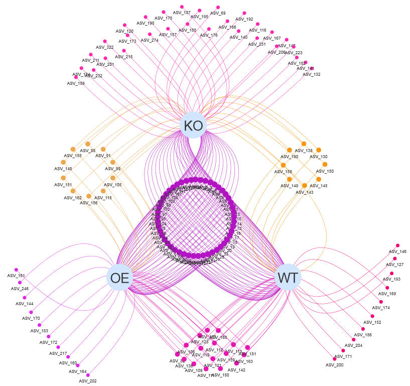
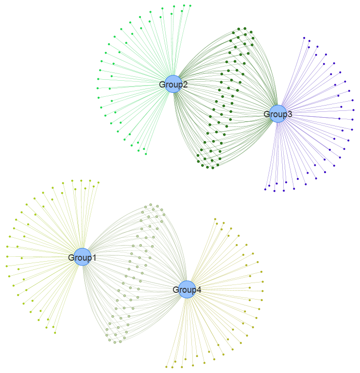
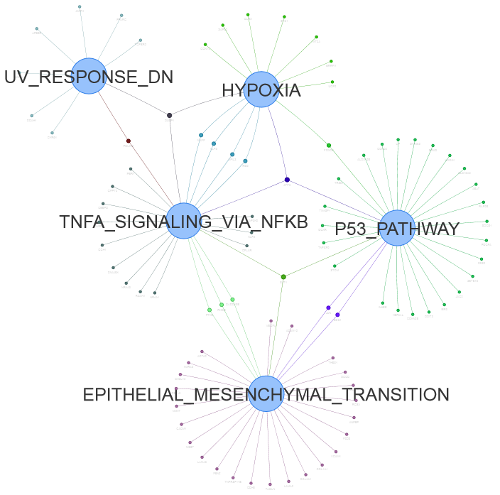

--- 
title: "EVenn: Easy to create repeatable, editable, and statistically measurable Venn diagrams online"
author: 
- "Chen Tong"
- "http://www.ehbio.com/test/venn"
- "chent@nrc.ac.cn"
date: "`r Sys.Date()`"
documentclass: article
site: bookdown::bookdown_site
---

```{r setup, include=FALSE}
library(knitr)
output <- opts_knit$get("rmarkdown.pandoc.to")
output <- "html"
html = FALSE
latex = FALSE
opts_chunk$set(echo = FALSE, out.width="100%", fig.align="center", fig.show="hold", warning=FALSE, message=FALSE)
if (output=="html") {
	html = TRUE
}
if (output=="latex") {
	opts_chunk$set(out.width="95%", out.height='0.7\\textheight', out.extra='keepaspectratio=true', fig.pos='H')
	latex = TRUE
}
html = TRUE
knitr::opts_chunk$set(cache=TRUE, autodep=TRUE)
mtime <- function(files){
  lapply(Sys.glob(files), function(x) file.info(x)$mtime)
}
set.seed(0304)
```


# Overview of EVenn

[EVenn](http://www.ehbio.com/test/venn/#/) is constructed to generate Venn diagrams (classical and Edwards layout), Euler diagrams (proportional), UpSet, Flower plot and Venn network. Specially, we developed one unified data matrix as inputs for all tools. This type of input data could be easily prepared using Excel or other text-editors or simple programs. Once uploaded, the data file could be easily loaded to each tool to generate various displaying. This makes EVenn a more suitable tool for exploratory analysis and to choose the best way to explain and visualize data. In order to compute the significance of the overlap between two groups of elements which could be genes or OTUs, random sample test and Jaccard similarity test were applied. The tool Venn calculator could generate the counts and detailed elements for each non-empty intersection for datasets with any number of groups. The results could be used for downstream selection and also could be used as input for data visualization using EVenn. Evenn is available at http://www.ehbio.com/test/venn/. We also recorded a video showing how to generate 5 types of Venn diagrams in less than 3 minutes (which could be viewed in this tutorial or in YouTube with link https://youtu.be/sCEiaZpnL8Q or in China with link https://www.bilibili.com/video/BV1CK4y1P7Gi). 

```{r}
knitr::include_graphics("image/Overviewvenn.png")
```


<video controls width="100%">
    <source src="video/EVenn7.webm"  type="video/webm">
    Sorry, your browser doesn't support embedded videos.
</video>

## Video at Youtube

```{r}
knitr::include_url("https://youtu.be/sCEiaZpnL8Q")
```


## Demo data and animations

Each tool contains at least one copy of demo data for beginners. Normally only `one click on the Submit button` is needed to generate the demo result.

Pictures and animations illustrating the usages of every tools step by step are recorded in following sections. `Left arrow key` and `right arrow key` in the keyboard could be used to navigate this document to change sections.

Some example data are also listed in the second section - [Example files](#example_file).

## Hints for question mark symbol

This may be a common sense that question mark symbol (`?`) hides help information. 

```{r questionMark, fig.cap="Hovering the mouse cursor on any question mark symbol to see help or description information."}
knitr::include_graphics("image/questionMark.png")
```


## Gallary {#gallary} 

### Venn network for OTUs

(ref:vennNetwork00label) Venn network using demo data Click <https://www.bilibili.com/video/BV1CK4y1P7Gi?p=2> to view the tutorials.

```{r vennNetwork00, fig.cap="(ref:vennNetwork00label)"}

```


<video controls width="100%">
    <source src="video/EVennNetwork.webm"  type="video/webm">
    Sorry, your browser doesn't support embedded videos.
</video>

```{r}
knitr::include_url("https://youtu.be/8zf_XuwaZRw")
```

### Venn network for DE genes

(ref:VennNetworkGallery1label) Venn network using data <DE_gene_file.txt> in [example data](#example_file).

```{r VennNetworkGallery1, fig.cap="(ref:VennNetworkGallery1label)"}

```

### Venn network for pathway enrichment results

(ref:VennNetworkGalleryP53pathway) Venn network using data <Gene_enrichment.txt> in [example data](#example_file).

```{r VennNetworkGalleryP53pathway, fig.cap="(ref:VennNetworkGallery1label)"}

```

### Venn network for 12 sets

(ref:Vennnetworkgallary12sets) Venn network using data <taxonomy_highabundance_manysets.txt> in [example data](#example_file).


```{r Vennnetworkgallary12sets, out.width="48%", fig.cap="(ref:VennNetworkGallery1label)"}
knitr::include_graphics(c("image/Vennnetworkgallary12sets.png",
                          "image/Vennnetworkgallary12setsparameters.png"))
```


## How to cite?

EVenn is constructed since 2018 and is initially treated as a sub-tool of ImageGP (a free online plotting platform) with accessing address as www.ehbio.com/ImageGP/index.php/Home/Index/VennDiagram.html and has been cited directly for at least 16 times (according to google scholar). 

In year 2021 we remodeled EVenn as an independent tool (http://www.ehbio.com/test/venn) to support more functions with much clearer user interface. In last month, there are 2,749 unique visitors for new EVenn with different IP (Internet Protocol Address) from China, American and Europe. Everyday there are about 100 visitors. Currently there are 3 citations for new EVenn. 

Normally they would use `Venn diagrams were generated using EVenn (http://www.ehbio.com/test/venn).` as the citation sentences.


