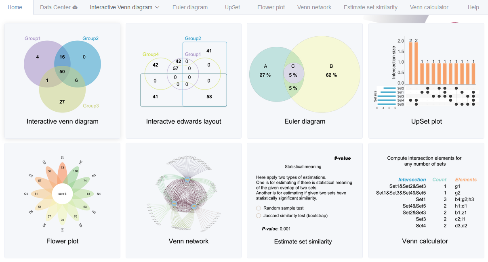

--- 
title: "EVenn: Easy to create repeatable, editable, and statistically measurable Venn diagrams online"
author: 
- "Chen Tong"
- "http://www.ehbio.com/test/venn"
- "chent@nrc.ac.cn"
date: "`r Sys.Date()`"
documentclass: article
site: bookdown::bookdown_site
---

```{r setup, include=FALSE}
library(knitr)
output <- opts_knit$get("rmarkdown.pandoc.to")
output <- "html"
html = FALSE
latex = FALSE
opts_chunk$set(echo = FALSE, out.width="100%", fig.align="center", fig.show="hold", warning=FALSE, message=FALSE)
if (output=="html") {
	html = TRUE
}
if (output=="latex") {
	opts_chunk$set(out.width="95%", out.height='0.7\\textheight', out.extra='keepaspectratio=true', fig.pos='H')
	latex = TRUE
}
html = TRUE
knitr::opts_chunk$set(cache=TRUE, autodep=TRUE)
mtime <- function(files){
  lapply(Sys.glob(files), function(x) file.info(x)$mtime)
}
set.seed(0304)
```


# Overview of EVenn {-}

we construct an on-line tool called EVenn to generate venn diagrams (classical and Edwards layout), Euler diagrams (proportional), Flower plot, Upset and Venn network. Specially, we developed one unified data matrix as inputs for all tools. This type of input data could be easily prepared using Excel or other text-editors or simple programs. Once uploaded, the data file could be easily loaded to each tool to generate various displaying. This makes EVenn a more suitable tool for exploratory analysis and to choose the best way to explain and visualize data. In order to compute the significance of the overlap between two groups of elements which could be genes or OTUs, random sample test and Jaccard similarity test were applied. The tool Venn calculator could generate the counts and detailed elements for each non-empty intersection for datasets with any number of groups. The results could be used for downstream selection and also could be used as input for data visualization using EVenn. Evenn is available at http://www.ehbio.com/test/venn/.

```{r}

```

## Demo data and animations

Each tool contains at least one copy of demo data for beginners. Normally onle `one click on the submit button` is needed to generate the demo result.

Pictures and animations illustrating the usages of every tools step by step are recorded in following sections. Some example data are also listed in the second section - [Example files](#example_file).

## Hints for question mark symbol

This may be a common sense that question mark symbol (`?`) hides help information. 

```{r questionMark, fig.cap="Hovering the mouse cursor on any question mark symbol to see help or description information."}
knitr::include_graphics("image/questionMark.png")
```


